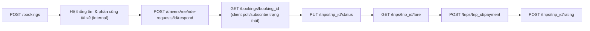
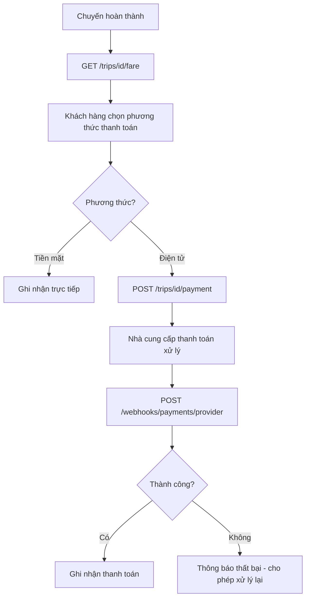

# 23637531_TranQuocThai_cabsystem_api
# CAB System – Tài liệu Đặc tả API
---
## Tổng quan tài liệu

Tài liệu này đặc tả các API của **CAB System**, được xây dựng dựa trên kết quả phân tích yêu cầu nghiệp vụ (Business Requirements BR01–BR21) và các Use Case (UC01–UC22) đã xác định ở tài liệu phân tích nghiệp vụ. Tài liệu API được trình bày theo từng bước, tương tự cấu trúc tài liệu nghiệp vụ, để nhóm phát triển (Backend/Frontend/QA) và các bên liên quan dễ đối chiếu API với yêu cầu gốc.

---
# BƯỚC 1 – QUY ƯỚC CHUNG

## 1.1. Base URL

| Môi trường | Base URL |
| --- | --- |
| Production | `https://api.cabsystem.com/api/v1` |
| Local/Dev | `http://localhost:8080/api/v1` |

## 1.2. Xác thực

Hệ thống sử dụng **Bearer Token (JWT)**. Mọi API yêu cầu tài khoản phải gửi header:
```text
Authorization: Bearer <access_token>
```
Quy tắc xác thực tuân theo BR-S01: Khách hàng và tài xế phải được xác thực trước khi sử dụng chức năng yêu cầu tài khoản.

## 1.3. Định dạng dữ liệu chung

**Response thành công:**
```json
{
  "success": true,
  "data": {},
  "message": "OK"
}
```

**Response lỗi:**
```json
{
  "success": false,
  "error_code": "RESOURCE_NOT_FOUND",
  "message": "Mô tả lỗi chi tiết"
}
```

## 1.4. Bảng mã trạng thái HTTP (Response Code)

| Code | Ý nghĩa |
| --- | --- |
| 200 OK | Thành công |
| 201 Created | Tạo mới thành công |
| 400 Bad Request | Dữ liệu đầu vào không hợp lệ |
| 401 Unauthorized | Chưa xác thực / token không hợp lệ |
| 403 Forbidden | Không có quyền thực hiện (BR02, BR-S02) |
| 404 Not Found | Không tìm thấy tài nguyên |
| 409 Conflict | Xung đột trạng thái nghiệp vụ |
| 500 Internal Server Error | Lỗi hệ thống |
---

# BƯỚC 2 – PHÂN RÃ API THEO MODULE

## 2.1. Khách hàng (Customer APIs)
```text
Customer APIs
├── Auth
│   ├── POST /auth/register
│   └── POST /auth/login
├── User
│   ├── GET /users/me
│   └── PUT /users/me
├── Booking
│   ├── POST /bookings
│   ├── GET /bookings/{booking_id}
│   └── POST /bookings/{booking_id}/cancel
├── Trip
│   ├── GET /trips/{trip_id}
│   ├── GET /trips/{trip_id}/fare
│   ├── POST /trips/{trip_id}/payment
│   └── POST /trips/{trip_id}/rating
└── Notification
    └── GET /notifications
```

## 2.2. Tài xế (Driver APIs)
```text
Driver APIs
├── Auth
│   └── POST /auth/login
├── Profile & Vehicle
│   └── PUT /drivers/me/profile
├── Trạng thái & Vị trí
│   ├── PUT /drivers/me/status
│   └── POST /drivers/me/location
├── Xử lý chuyến
│   ├── POST /drivers/me/ride-requests/{request_id}/respond
│   └── PUT /trips/{trip_id}/status
└── Notification
    └── GET /notifications
```

## 2.3. Nhân viên vận hành (Admin/Operator APIs)
```text
Operator APIs
├── Trip
│   ├── GET /admin/trips/active
│   └── POST /admin/trips/{trip_id}/resolve
├── Payment
│   └── GET /admin/payments
└── Report
    └── GET /admin/reports/summary
```

## 2.4. Hệ thống nội bộ / Bên thứ ba (System & External)
```text
System / Webhook APIs
├── Payment Provider
│   └── POST /webhooks/payments/{provider}
└── Notification Provider
    └── (internal event dispatch – không public endpoint)
```
---

# BƯỚC 3 – SƠ ĐỒ LUỒNG GỌI API (theo luồng nghiệp vụ trung tâm)


Sơ đồ trên tương ứng với luồng nghiệp vụ trung tâm: Đặt xe → Tìm tài xế → Phân công tài xế → Thực hiện chuyến → Tính cước → Thanh toán → Đánh giá.
---

# BƯỚC 4 – ĐẶC TẢ CHI TIẾT API

## API01 – Đăng ký tài khoản
| Thành phần | Nội dung |
| --- | --- |
| **Tên API** | Đăng ký tài khoản |
| **Endpoint** | `/auth/register` |
| **Method** | `POST` |
| **Actor chính** | Khách hàng / Tài xế |
| **Header** | `Content-Type: application/json` |
| **Tiền điều kiện** | Số điện thoại/email chưa tồn tại trong hệ thống |
| **Hậu điều kiện** | Tài khoản được tạo, ở trạng thái chưa xác thực hoặc đã kích hoạt |
### Request Body
```json
{
  "full_name": "Nguyen Van A",
  "phone": "0909123456",
  "email": "a@example.com",
  "password": "SecurePass123",
  "role": "customer"
}
```
### Response (201)
```json
{
  "success": true,
  "data": { "user_id": "U1001", "full_name": "Nguyen Van A", "role": "customer" }
}
```
### Basic Flow
| Client | Server |
| --- | --- |
| 1. Gửi thông tin đăng ký. | 2. Kiểm tra trùng lặp số điện thoại/email. |
|  | 3. Tạo tài khoản mới. |
|  | 4. Trả về thông tin tài khoản. |
### Exception
* Email/số điện thoại đã tồn tại → trả về lỗi `EMAIL_ALREADY_EXISTS` / `PHONE_ALREADY_EXISTS` (400).
---

## API02 – Đăng nhập
| Thành phần | Nội dung |
| --- | --- |
| **Tên API** | Đăng nhập |
| **Endpoint** | `/auth/login` |
| **Method** | `POST` |
| **Actor chính** | Khách hàng / Tài xế |
### Request Body
```json
{ "phone": "0909123456", "password": "SecurePass123" }
```
### Response (200)
```json
{
  "success": true,
  "data": {
    "access_token": "eyJhbGciOi...",
    "refresh_token": "dGhpcyBpcyBh...",
    "user": { "user_id": "U1001", "role": "customer" }
  }
}
```
### Exception
* Sai thông tin đăng nhập → `INVALID_CREDENTIALS` (401).
* Tài khoản bị khóa → `ACCOUNT_LOCKED` (403).
---

## API03 – Quản lý thông tin cá nhân
| Thành phần | Nội dung |
| --- | --- |
| **Tên API** | Lấy / cập nhật thông tin cá nhân |
| **Endpoint** | `/users/me` |
| **Method** | `GET` \| `PUT` |
| **Actor chính** | Khách hàng / Tài xế |
| **Header** | `Authorization: Bearer <token>` (bắt buộc) |
### Request Body (PUT)
```json
{ "full_name": "Nguyen Van A", "email": "a_new@example.com" }
```
### Exception
* Chưa xác thực → `UNAUTHORIZED` (401).
* Dữ liệu không hợp lệ → `VALIDATION_ERROR` (400).
---

## API04 – Cập nhật hồ sơ & phương tiện tài xế
| Thành phần | Nội dung |
| --- | --- |
| **Tên API** | Quản lý hồ sơ tài xế |
| **Endpoint** | `/drivers/me/profile` |
| **Method** | `PUT` |
| **Actor chính** | Tài xế |
| **Actor phụ** | Nhân viên vận hành (tra cứu/hỗ trợ) |
### Request Body
```json
{
  "license_number": "B2-123456",
  "vehicle": { "plate_number": "51H-123.45", "vehicle_type": "4-seat", "brand": "Toyota Vios" }
}
```
### Exception
* Giấy phép không hợp lệ → `INVALID_LICENSE` (400).
* Phương tiện đã được đăng ký → `VEHICLE_ALREADY_REGISTERED` (400).
---

## API05 – Cập nhật trạng thái tài xế
| Thành phần | Nội dung |
| --- | --- |
| **Tên API** | Cập nhật trạng thái hoạt động |
| **Endpoint** | `/drivers/me/status` |
| **Method** | `PUT` |
| **Actor chính** | Tài xế |
### Request Body
```json
{ "status": "online" }
```
`status`: `online` \| `offline` \| `busy`. Khi tài xế chuyển sang trạng thái không sẵn sàng, hệ thống không đề xuất chuyến mới cho tài xế đó.
---

## API06 – Cập nhật vị trí tài xế
| Thành phần | Nội dung |
| --- | --- |
| **Tên API** | Cập nhật vị trí tài xế |
| **Endpoint** | `/drivers/me/location` |
| **Method** | `POST` |
| **Actor chính** | Tài xế |
| **Mô tả** | Gọi định kỳ khi tài xế online hoặc đang thực hiện chuyến, phục vụ tìm tài xế gần khách hàng (BR08) và ước tính thời gian đến. |
### Request Body
```json
{ "lat": 10.7769, "lng": 106.7009, "heading": 120, "timestamp": "2026-09-07T10:05:00Z" }
```
---

## API07 – Tạo yêu cầu đặt xe
| Thành phần | Nội dung |
| --- | --- |
| **Tên API** | Tạo yêu cầu đặt xe |
| **Endpoint** | `/bookings` |
| **Method** | `POST` |
| **Actor chính** | Khách hàng |
| **Tiền điều kiện** | Khách hàng đã đăng nhập |
| **Hậu điều kiện** | Yêu cầu đặt xe được tạo, hệ thống bắt đầu tìm tài xế |
### Request Body
```json
{
  "pickup": { "lat": 10.776, "lng": 106.700, "address": "123 Nguyen Hue, Q1" },
  "dropoff": { "lat": 10.800, "lng": 106.660, "address": "456 Cong Hoa, Tan Binh" },
  "vehicle_type": "4-seat",
  "payment_method": "cash"
}
```
### Response (201)
```json
{ "success": true, "data": { "booking_id": "BK20260907001", "status": "searching_driver" } }
```
### Exception
* Vị trí không hợp lệ → `INVALID_LOCATION` (400).
* Ngoài khu vực phục vụ → `NO_SERVICE_AREA` (400).
---

## API08 – Theo dõi trạng thái yêu cầu đặt xe / chuyến đi
| Thành phần | Nội dung |
| --- | --- |
| **Tên API** | Theo dõi trạng thái |
| **Endpoint** | `/bookings/{booking_id}` |
| **Method** | `GET` |
| **Actor chính** | Khách hàng |
| **Actor phụ** | CAB System / Tài xế |
### URL Parameters
* `booking_id` (bắt buộc, path): mã định danh yêu cầu đặt xe.
### Response (200)
```json
{
  "success": true,
  "data": {
    "booking_id": "BK20260907001",
    "status": "driver_assigned",
    "driver": { "driver_id": "D2002", "name": "Tran Van B", "vehicle_plate": "51H-123.45" },
    "eta_minutes": 5
  }
}
```
`status`: `searching_driver`, `driver_assigned`, `driver_arriving`, `picked_up`, `on_trip`, `completed`, `cancelled`, `no_driver_found`.
### Alternative Flow
* Chưa có tài xế → trả về `status = searching_driver`.
* Đã có tài xế → trả về thông tin tài xế và `eta_minutes`.
### Exception
* Không tìm thấy yêu cầu → `BOOKING_NOT_FOUND` (404).
---

## API09 – Hủy yêu cầu đặt xe
| Thành phần | Nội dung |
| --- | --- |
| **Tên API** | Hủy yêu cầu đặt xe |
| **Endpoint** | `/bookings/{booking_id}/cancel` |
| **Method** | `POST` |
| **Actor chính** | Khách hàng |
### Request Body
```json
{ "reason": "Đổi kế hoạch di chuyển" }
```
### Exception
* Chuyến đã hoàn thành → `BOOKING_ALREADY_COMPLETED` (409).
* Không được phép hủy ở trạng thái hiện tại → `CANCEL_NOT_ALLOWED` (409).
---

## API10 – Tài xế nhận / từ chối yêu cầu chuyến
| Thành phần | Nội dung |
| --- | --- |
| **Tên API** | Phản hồi yêu cầu chuyến |
| **Endpoint** | `/drivers/me/ride-requests/{request_id}/respond` |
| **Method** | `POST` |
| **Actor chính** | Tài xế |
| **Actor phụ** | CAB System |
### Request Body
```json
{ "action": "accept" }
```
`action`: `accept` \| `reject`.
### Basic Flow
| Client (Tài xế) | Server |
| --- | --- |
|  | 1. Gửi thông báo chuyến mới đến tài xế. |
| 2. Tài xế xem thông tin chuyến. | 3. Hiển thị thông tin chuyến. |
| 4. Tài xế phản hồi (accept/reject). | 5. Ghi nhận kết quả. |
|  | 6. Thông báo kết quả cho khách hàng. |
### Alternative Flow
* Tài xế từ chối → hệ thống tìm tài xế tiếp theo (BR07).
### Exception
* Tài xế không phản hồi kịp thời gian quy định → `REQUEST_EXPIRED` (409), hệ thống tự động tìm tài xế khác (BR06) mà không yêu cầu khách hàng tạo lại yêu cầu (BR08).
* Yêu cầu đã được tài xế khác nhận → `REQUEST_ALREADY_TAKEN` (409).
---

## API11 – Cập nhật trạng thái chuyến đi
| Thành phần | Nội dung |
| --- | --- |
| **Tên API** | Cập nhật trạng thái chuyến |
| **Endpoint** | `/trips/{trip_id}/status` |
| **Method** | `PUT` |
| **Actor chính** | Tài xế |
### Request Body
```json
{ "status": "arrived_pickup" }
```
`status` phải tuân theo đúng thứ tự trạng thái: `arrived_pickup` → `picked_up` → `on_trip` → `completed` (mục 10.4 tài liệu nghiệp vụ).
### Exception
* Chuyển trạng thái không hợp lệ (sai thứ tự) → `INVALID_STATUS_TRANSITION` (409).
---

## API12 – Lấy chi tiết chuyến đi
| Thành phần | Nội dung |
| --- | --- |
| **Tên API** | Chi tiết chuyến đi |
| **Endpoint** | `/trips/{trip_id}` |
| **Method** | `GET` |
| **Actor chính** | Khách hàng / Tài xế |
### Response (200)
```json
{
  "success": true,
  "data": { "trip_id": "TR20260907001", "status": "on_trip", "pickup_time": "2026-09-07T10:10:00Z", "distance_km": null, "fare": null }
}
```
### Exception
* Không tìm thấy chuyến → `404 Not Found`.
---

## API13 – Tính cước sau khi hoàn thành chuyến
| Thành phần | Nội dung |
| --- | --- |
| **Tên API** | Tính cước |
| **Endpoint** | `/trips/{trip_id}/fare` |
| **Method** | `GET` |
| **Actor chính** | Khách hàng |
| **Tiền điều kiện** | `trip.status = completed` (BR11: chỉ xác định cước sau khi chuyến hoàn thành) |
### Response (200)
```json
{
  "success": true,
  "data": { "trip_id": "TR20260907001", "distance_km": 8.4, "duration_minutes": 22, "vehicle_type": "4-seat", "total_fare": 95000, "currency": "VND" }
}
```
### Exception
* Chuyến chưa hoàn thành → `TRIP_NOT_COMPLETED` (409).
---

## API14 – Thanh toán chuyến đi
| Thành phần | Nội dung |
| --- | --- |
| **Tên API** | Thanh toán |
| **Endpoint** | `/trips/{trip_id}/payment` |
| **Method** | `POST` |
| **Actor chính** | Khách hàng |
| **Actor phụ** | Nhà cung cấp thanh toán |
### Request Body
```json
{ "payment_method": "e-wallet", "provider": "momo" }
```
`payment_method`: `cash` \| `e-wallet` \| `card`.
### Basic Flow
| Client | Server |
| --- | --- |
| 1. Khách hàng chọn phương thức thanh toán. | 2. Hiển thị số tiền cần thanh toán. |
| 3. Khách hàng xác nhận thanh toán. | 4. Gửi yêu cầu đến nhà cung cấp thanh toán nếu là điện tử. |
|  | 5. Nhận và ghi nhận kết quả giao dịch. |
|  | 6. Thông báo kết quả cho khách hàng. |
### Alternative Flow
* Chọn **tiền mặt** → ghi nhận trực tiếp theo quy trình doanh nghiệp.
* Chọn **thanh toán điện tử** → chuyển yêu cầu đến nhà cung cấp thanh toán bên ngoài (BR13).
### Exception
* Thanh toán thất bại → `PAYMENT_FAILED` (402), thông báo cho khách hàng và cho phép xử lý lại theo chính sách doanh nghiệp (BR15).
* Nhà cung cấp không phản hồi kịp → `PAYMENT_PROVIDER_TIMEOUT` (504).
> Lưu ý bảo mật (BR14, BR-S07): hệ thống CAB không lưu trực tiếp thông tin nhạy cảm của thẻ/tài khoản thanh toán.
---

## API15 – Webhook kết quả thanh toán
| Thành phần | Nội dung |
| --- | --- |
| **Tên API** | Webhook thanh toán |
| **Endpoint** | `/webhooks/payments/{provider}` |
| **Method** | `POST` |
| **Actor chính** | Nhà cung cấp thanh toán |
| **Header** | `X-Signature: <hmac_signature>` (bắt buộc, xác thực nguồn gọi) |
### Request Body
```json
{ "payment_id": "PM20260907001", "status": "success", "transaction_ref": "MOMO-998877" }
```
### Exception
* Chữ ký không hợp lệ → `INVALID_SIGNATURE` (401).
---

## API16 – Danh sách thông báo
| Thành phần | Nội dung |
| --- | --- |
| **Tên API** | Lấy danh sách thông báo |
| **Endpoint** | `/notifications` |
| **Method** | `GET` |
| **Actor chính** | Khách hàng / Tài xế |
### URL Parameters
* `unread_only` (tùy chọn): `true` \| `false`.
### Bảng sự kiện thông báo hệ thống tự phát sinh
| Sự kiện | Đối tượng nhận |
| :--- | :--- |
| Yêu cầu đặt xe được tiếp nhận | Khách hàng |
| Tài xế nhận chuyến | Khách hàng |
| Tài xế đến điểm đón | Khách hàng |
| Chuyến hoàn thành | Khách hàng |
| Thanh toán có kết quả | Khách hàng |
| Có chuyến mới | Tài xế |
| Có thay đổi liên quan đến chuyến | Tài xế |
---

## API17 – Khách hàng đánh giá tài xế
| Thành phần | Nội dung |
| --- | --- |
| **Tên API** | Đánh giá tài xế |
| **Endpoint** | `/trips/{trip_id}/rating` |
| **Method** | `POST` |
| **Actor chính** | Khách hàng |
| **Tiền điều kiện** | Chuyến đi đã hoàn thành |
### Request Body
```json
{ "stars": 5, "comment": "Tài xế thân thiện, đi đúng giờ" }
```
`stars`: số nguyên 1–5 (bắt buộc).
### Exception
* Chuyến chưa hoàn thành → `TRIP_NOT_COMPLETED` (409).
* Đã đánh giá trước đó → `ALREADY_RATED` (409).
---

## API18 – Danh sách chuyến đang diễn ra
| Thành phần | Nội dung |
| --- | --- |
| **Tên API** | Giám sát chuyến đang diễn ra |
| **Endpoint** | `/admin/trips/active` |
| **Method** | `GET` |
| **Actor chính** | Nhân viên vận hành |
### Exception
* Không có quyền truy cập → `FORBIDDEN` (403), theo BR-S02.
---

## API19 – Xử lý chuyến gặp sự cố
| Thành phần | Nội dung |
| --- | --- |
| **Tên API** | Xử lý sự cố chuyến đi |
| **Endpoint** | `/admin/trips/{trip_id}/resolve` |
| **Method** | `POST` |
| **Actor chính** | Nhân viên vận hành |
### Request Body
```json
{ "action": "reassign_driver", "note": "Tài xế báo sự cố xe" }
```
---

## API20 – Tra cứu giao dịch thanh toán
| Thành phần | Nội dung |
| --- | --- |
| **Tên API** | Tra cứu giao dịch |
| **Endpoint** | `/admin/payments` |
| **Method** | `GET` |
| **Actor chính** | Nhân viên vận hành |
### URL Parameters
* `from_date`, `to_date` (tùy chọn): khoảng thời gian tra cứu.
* `status` (tùy chọn): `success` \| `failed` \| `pending`.
---

## API21 – Báo cáo tổng hợp hoạt động
| Thành phần | Nội dung |
| --- | --- |
| **Tên API** | Báo cáo tổng hợp |
| **Endpoint** | `/admin/reports/summary` |
| **Method** | `GET` |
| **Actor chính** | Ban lãnh đạo / Nhân viên vận hành |
### URL Parameters
* `from_date`, `to_date` (bắt buộc): khoảng thời gian báo cáo.
### Response (200)
```json
{
  "success": true,
  "data": {
    "total_trips": 1520,
    "total_revenue": 145000000,
    "completion_rate": 0.94,
    "cancellation_rate": 0.06,
    "top_drivers": [{ "driver_id": "D2002", "trips_completed": 88 }]
  }
}
```
---

# BƯỚC 5 – QUY TẮC TÍNH CƯỚC & THANH TOÁN LIÊN QUAN ĐẾN API


---

# BƯỚC 6 – BẢNG MÃ LỖI TỔNG HỢP

| error_code | HTTP Status | Ý nghĩa |
| --- | --- | --- |
| EMAIL_ALREADY_EXISTS | 400 | Email đã được đăng ký |
| PHONE_ALREADY_EXISTS | 400 | Số điện thoại đã được đăng ký |
| INVALID_CREDENTIALS | 401 | Sai thông tin đăng nhập |
| ACCOUNT_LOCKED | 403 | Tài khoản bị khóa |
| UNAUTHORIZED | 401 | Chưa xác thực |
| FORBIDDEN | 403 | Không đủ quyền (BR-S02) |
| VALIDATION_ERROR | 400 | Dữ liệu không hợp lệ |
| INVALID_LOCATION | 400 | Vị trí đón/trả không hợp lệ |
| NO_SERVICE_AREA | 400 | Khu vực ngoài phạm vi phục vụ |
| BOOKING_NOT_FOUND | 404 | Không tìm thấy yêu cầu đặt xe |
| BOOKING_ALREADY_COMPLETED | 409 | Chuyến đã hoàn thành, không thể hủy |
| CANCEL_NOT_ALLOWED | 409 | Không được phép hủy ở trạng thái hiện tại |
| NO_DRIVER_AVAILABLE | 409 | Không tìm được tài xế phù hợp (BR09) |
| REQUEST_EXPIRED | 409 | Tài xế không phản hồi kịp thời gian quy định |
| REQUEST_ALREADY_TAKEN | 409 | Yêu cầu đã được tài xế khác nhận |
| INVALID_STATUS_TRANSITION | 409 | Chuyển trạng thái chuyến không hợp lệ |
| TRIP_NOT_COMPLETED | 409 | Thao tác yêu cầu chuyến đã hoàn thành |
| PAYMENT_FAILED | 402 | Thanh toán điện tử thất bại (BR15) |
| PAYMENT_PROVIDER_TIMEOUT | 504 | Nhà cung cấp thanh toán không phản hồi kịp |
| ALREADY_RATED | 409 | Chuyến đã được đánh giá trước đó |
| INVALID_SIGNATURE | 401 | Chữ ký webhook không hợp lệ |
| INVALID_LICENSE | 400 | Giấy phép lái xe không hợp lệ |
| VEHICLE_ALREADY_REGISTERED | 400 | Phương tiện đã được đăng ký bởi tài khoản khác |
---

# BƯỚC 7 – GHI CHÚ BẢO MẬT & LƯU VẾT (BR-S01 – BR-S08)

* Mọi API yêu cầu tài khoản đều phải xác thực qua Bearer Token (BR-S01).
* API nhóm `/admin/*` bắt buộc kiểm tra phân quyền theo vai trò (BR-S02).
* Dữ liệu vị trí tài xế, thông tin cá nhân, thông tin phương tiện và dữ liệu giao dịch được truyền qua HTTPS và mã hóa khi lưu trữ (BR-S03, BR-S04, BR-S05, BR-S06).
* Không có API nào nhận hoặc trả về trực tiếp số thẻ/tài khoản thanh toán — toàn bộ xử lý qua nhà cung cấp thanh toán bên ngoài (BR-S07).
* Các thao tác quan trọng (đổi trạng thái chuyến, thanh toán, thao tác quản trị) được ghi log phục vụ audit (BR-S08).
