# 23637531_TranQuocThai_capsytem
# CAB System – Phân tích yêu cầu nghiệp vụ
---
## Tổng quan dự án

Công ty ABC là doanh nghiệp cung cấp dịch vụ đặt xe trực tuyến. Hiện tại khách hàng có thể liên hệ tổng đài hoặc sử dụng một ứng dụng đơn giản để yêu cầu xe.
Tuy nhiên, hệ thống hiện tại còn tồn tại nhiều hạn chế:
* Phân công tài xế chủ yếu được thực hiện thủ công.
* Khách hàng khó theo dõi trạng thái chuyến đi.
* Thông tin thanh toán chưa được quản lý tập trung.
* Bộ phận vận hành gặp khó khăn khi mở rộng hệ thống.
* Khả năng phát triển thêm tính năng trong tương lai còn hạn chế.
Do đó, Công ty ABC mong muốn xây dựng một nền tảng CAB mới có khả năng phục vụ số lượng lớn khách hàng và tài xế, đồng thời có kiến trúc đủ linh hoạt để phát triển lâu dài.
---
# BƯỚC 1 – TÌM HIỂU NGHIỆP VỤ
## 1.1. Vấn đề
Hệ thống hiện tại chưa đáp ứng tốt quá trình đặt và quản lý chuyến xe.
Các vấn đề chính:
1. Phân công tài xế còn thủ công.
2. Khách hàng khó theo dõi chuyến đi.
3. Thanh toán chưa được quản lý tập trung.
4. Nhân viên vận hành gặp khó khăn trong việc quản lý.
5. Khả năng mở rộng hệ thống còn hạn chế.
## 1.2. Mục tiêu
Xây dựng hệ thống CAB System nhằm:
* Tự động hóa quy trình đặt xe.
* Tìm kiếm và phân công tài xế phù hợp.
* Theo dõi trạng thái chuyến đi.
* Tính cước và hỗ trợ thanh toán.
* Gửi thông báo cho khách hàng và tài xế.
* Hỗ trợ nhân viên vận hành.
* Cung cấp báo cáo cho ban lãnh đạo.
* Đảm bảo bảo mật và khả năng mở rộng.
## 1.3. Người sử dụng hệ thống
Hệ thống có 3 nhóm người dùng chính:
| Người sử dụng      | Vai trò                      |
| ------------------ | ---------------------------- |
| Khách hàng         | Đặt xe và sử dụng dịch vụ    |
| Tài xế             | Nhận và thực hiện chuyến     |
| Nhân viên vận hành | Quản lý và giám sát hệ thống |
Ngoài ra còn có:
* **Ban lãnh đạo:** sử dụng dữ liệu và báo cáo để theo dõi hoạt động.
* **Nhà cung cấp thanh toán:** xử lý thanh toán điện tử.
* **Nhà cung cấp thông báo:** hỗ trợ gửi thông báo.
Tài liệu yêu cầu xác định rõ ba nhóm người dùng chính gồm khách hàng, tài xế và nhân viên vận hành.
---
# BƯỚC 2 – PHÂN TÍCH CÁC BÊN LIÊN QUAN
## 2.1. Stakeholders
| Stakeholders            | Vai trò                    | Tương tác với hệ thống                                    |
| ----------------------- | -------------------------- | --------------------------------------------------------- |
| Khách hàng              | Người sử dụng dịch vụ      | Đăng ký, đặt xe, theo dõi chuyến, thanh toán, đánh giá    |
| Tài xế                  | Người thực hiện chuyến     | Nhận/từ chối chuyến, cập nhật trạng thái, cập nhật vị trí |
| Nhân viên vận hành      | Quản lý hoạt động          | Quản lý khách hàng, tài xế, phương tiện và chuyến đi      |
| Ban lãnh đạo            | Quản lý doanh nghiệp       | Theo dõi báo cáo, doanh thu và hiệu quả hoạt động         |
| Nhà cung cấp thanh toán | Xử lý thanh toán           | Nhận yêu cầu và trả kết quả thanh toán                    |
| Nhà cung cấp thông báo  | Cung cấp dịch vụ thông báo | Gửi thông báo đến khách hàng và tài xế                    |

### 2.2. Ma trận Stakeholder (Mendelow Matrix)
* **Manage Closely (Quản lý chặt chẽ - Quyền lực cao, Quan tâm cao):** Ban Giám đốc ABC, Trưởng phòng Vận hành.
* **Keep Satisfied (Làm họ hài lòng - Quyền lực cao, Quan tâm thấp):** Cổng thanh toán đối tác, Cơ quan quản lý pháp lý vận tải.
* **Keep Informed (Cập nhật thường xuyên - Quyền lực thấp, Quan tâm cao):** Khách hàng, Đội ngũ Tài xế, Nhân viên CSKH.
* **Monitor (Giám sát tối thiểu - Quyền lực thấp, Quan tâm thấp):** Nhà cung cấp hạ tầng hosting/máy chủ.
> **Ma trận các bên liên quan (Stakeholder Power / Interest Matrix)

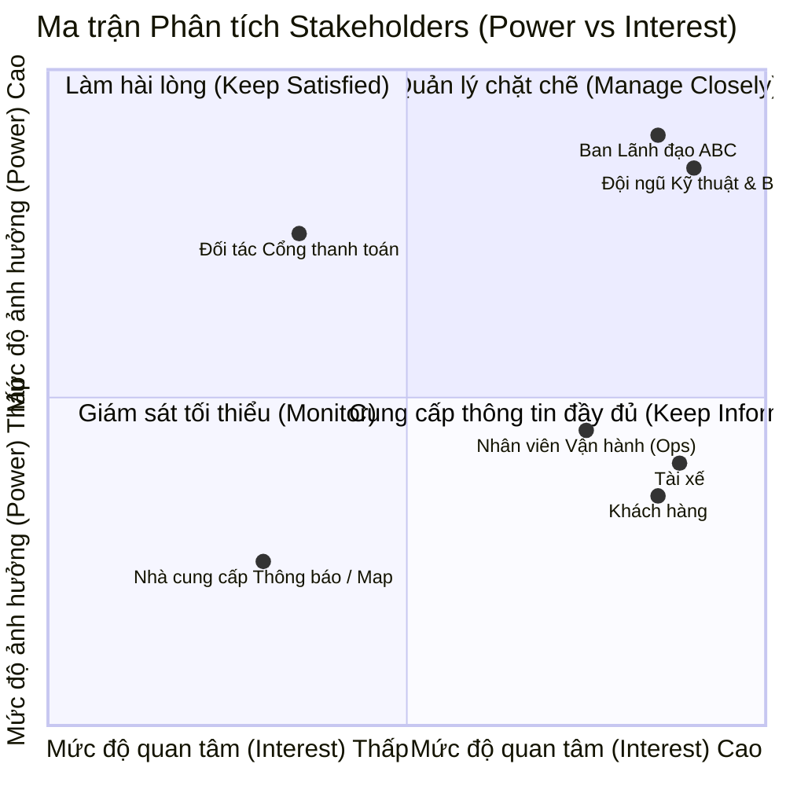
---
# BƯỚC 3 – MỤC ĐÍCH NGHIỆP VỤ
## 3.1. Mục đích tổng quát
Xây dựng một nền tảng CAB có khả năng quản lý toàn bộ quy trình:
```text
Đặt xe
   ↓
Tìm tài xế
   ↓
Phân công tài xế
   ↓
Thực hiện chuyến
   ↓
Tính cước
   ↓
Thanh toán
   ↓
Thông báo
   ↓
Đánh giá
```
## 3.2. Các mục đích chính
### 1. Tự động hóa đặt xe
Cho phép khách hàng tạo yêu cầu đặt xe trực tiếp trên hệ thống.
### 2. Tự động tìm tài xế
Hệ thống xác định tài xế phù hợp dựa trên vị trí, trạng thái sẵn sàng và các tiêu chí vận hành.
### 3. Theo dõi chuyến đi
Khách hàng có thể biết:
* Hệ thống đang tìm tài xế.
* Tài xế nào đã nhận chuyến.
* Thời gian dự kiến tài xế đến.
* Trạng thái hiện tại của chuyến.
### 4. Quản lý thanh toán
Hệ thống xác định số tiền cần thanh toán và hỗ trợ:
* Tiền mặt.
* Thanh toán điện tử.
### 5. Hỗ trợ vận hành
Nhân viên có thể quản lý:
* Khách hàng.
* Tài xế.
* Phương tiện.
* Chuyến đi.
* Giao dịch.
* Các trường hợp lỗi.
### 6. Hỗ trợ phát triển lâu dài
Hệ thống cần có khả năng bổ sung:
* Loại dịch vụ mới.
* Phương thức thanh toán mới.
* Nhà cung cấp thông báo mới.
* Thành phần kỹ thuật mới.
---
# BƯỚC 4 – XÁC ĐỊNH PHẠM VI DỰ ÁN
## 4.1. Thời gian
**Thời gian xây dựng và triển khai: 7 tuần.**
Vì thời gian giới hạn, dự án tập trung vào các chức năng nghiệp vụ cốt lõi.
## 4.2. Trong phạm vi
### Quản lý người dùng
* Đăng ký.
* Đăng nhập.
* Cập nhật thông tin.
* Quản lý tài khoản khách hàng.
* Quản lý tài khoản tài xế.
### Quản lý tài xế
* Quản lý hồ sơ.
* Quản lý phương tiện.
* Cập nhật trạng thái hoạt động.
* Cập nhật vị trí.
### Đặt xe
* Nhập điểm đón.
* Nhập điểm đến.
* Chọn loại xe.
* Gửi yêu cầu đặt xe.
### Phân công tài xế
* Tìm tài xế phù hợp.
* Ưu tiên tài xế gần khách hàng.
* Gửi yêu cầu cho tài xế.
* Xử lý tài xế từ chối/không phản hồi.
* Tiếp tục tìm tài xế khác.
### Quản lý chuyến
* Tài xế đến điểm đón.
* Đã đón khách.
* Đang di chuyển.
* Hoàn thành chuyến.
### Thanh toán
* Tính cước.
* Thanh toán tiền mặt.
* Thanh toán điện tử.
* Xử lý thanh toán thất bại.
### Thông báo
* Thông báo tiếp nhận yêu cầu.
* Thông báo tài xế nhận chuyến.
* Thông báo tài xế đến.
* Thông báo hoàn thành chuyến.
* Thông báo kết quả thanh toán.
### Quản trị
* Quản lý khách hàng.
* Quản lý tài xế.
* Quản lý phương tiện.
* Quản lý chuyến đi.
* Theo dõi chuyến đang diễn ra.
* Xử lý sự cố.
* Tra cứu giao dịch.
* Báo cáo.
## 4.3. Các vấn đề chưa chốt
Tài liệu xác định một số nội dung cần được Business Analyst làm rõ trước khi phát triển:
* Cách tính cước.
* Tiêu chí ưu tiên tài xế.
* Thời gian tài xế phải phản hồi.
* Chính sách hủy chuyến.
* Xử lý khi mất kết nối mạng.
* Thời gian lưu trữ dữ liệu.
---
# BƯỚC 5 – XÁC ĐỊNH YÊU CẦU NGHIỆP VỤ
| ID   | Business Requirement | Nội dung                                        |
| ---- | -------------------- | ----------------------------------------------- |
| BR01 | Quản lý khách hàng   | Quản lý tài khoản và thông tin khách hàng       |
| BR02 | Quản lý tài xế       | Quản lý tài khoản, hồ sơ và trạng thái          |
| BR03 | Quản lý phương tiện  | Quản lý thông tin phương tiện                   |
| BR04 | Đặt xe               | Cho phép khách hàng tạo yêu cầu đặt xe          |
| BR05 | Tìm tài xế           | Tìm tài xế phù hợp với chuyến                   |
| BR06 | Phân công tài xế     | Phân công tài xế cho yêu cầu                    |
| BR07 | Quản lý chuyến       | Theo dõi và cập nhật trạng thái chuyến          |
| BR08 | Quản lý vị trí       | Lưu vị trí tài xế                               |
| BR09 | Tính cước            | Xác định số tiền khách hàng phải trả            |
| BR10 | Thanh toán           | Hỗ trợ tiền mặt và điện tử                      |
| BR11 | Thông báo            | Gửi thông báo đến khách hàng và tài xế          |
| BR12 | Quản lý vận hành     | Theo dõi và xử lý hoạt động                     |
| BR13 | Báo cáo              | Báo cáo chuyến, doanh thu, tỷ lệ hoàn thành/hủy |
| BR14 | Đánh giá             | Khách hàng đánh giá tài xế                      |
| BR15 | Bảo mật              | Bảo vệ dữ liệu và kiểm soát quyền               |
---
# BƯỚC 6 – PHÂN RÃ YÊU CẦU CHỨC NĂNG
## 6.1. Khách hàng
```text
Khách hàng
├── Đăng ký
├── Đăng nhập
├── Cập nhật thông tin
├── Đặt xe
│   ├── Nhập điểm đón
│   ├── Nhập điểm đến
│   └── Chọn loại xe
├── Theo dõi chuyến
├── Xem lịch sử chuyến
├── Xem cước
├── Thanh toán
└── Đánh giá tài xế
```
## 6.2. Tài xế
```text
Tài xế
├── Quản lý hồ sơ
├── Quản lý phương tiện
├── Cập nhật trạng thái
├── Nhận thông báo chuyến
├── Chấp nhận chuyến
├── Từ chối chuyến
├── Cập nhật trạng thái chuyến
└── Cập nhật vị trí
```
## 6.3. Nhân viên vận hành
```text
Nhân viên vận hành
├── Quản lý khách hàng
├── Quản lý tài xế
├── Quản lý phương tiện
├── Quản lý chuyến đi
├── Theo dõi chuyến đang diễn ra
├── Kiểm tra trạng thái tài xế
├── Xử lý chuyến bị lỗi
├── Tra cứu giao dịch
└── Quản lý quyền truy cập
```
## 6.4. Hệ thống
```text
CAB System
├── Tìm tài xế
├── Phân công tài xế
├── Tính cước
├── Xử lý thanh toán
├── Gửi thông báo
├── Quản lý trạng thái chuyến
├── Lưu dữ liệu
└── Ghi log thao tác
```
---
# BƯỚC 7 – USE CASE DIAGRAM
## 7.1. Use case tổng quát
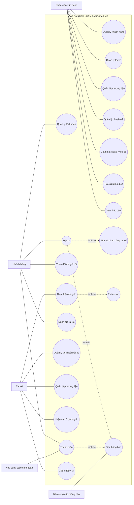
### Actor: Khách hàng
* Đăng ký / Đăng nhập
* Quản lý thông tin cá nhân
* Đặt xe
* Theo dõi chuyến
* Xem lịch sử
* Thanh toán
* Đánh giá tài xế
### Actor: Tài xế
* Quản lý hồ sơ
* Quản lý phương tiện
* Cập nhật trạng thái
* Nhận chuyến
* Chấp nhận/Từ chối chuyến
* Cập nhật trạng thái chuyến
* Cập nhật vị trí
### Actor: Nhân viên vận hành
* Quản lý khách hàng
* Quản lý tài xế
* Quản lý phương tiện
* Quản lý chuyến
* Giám sát chuyến
* Xử lý sự cố
* Tra cứu giao dịch
* Xem báo cáo
### External Actors
* Nhà cung cấp thanh toán.
* Nhà cung cấp thông báo.
## 7.2. Use Case trung tâm
```text
Khách hàng
    │
    ▼
Đặt xe
    │
    ▼
Tìm tài xế
    │
    ▼
Phân công tài xế
    │
    ▼
Thực hiện chuyến
    │
    ▼
Tính cước
    │
    ▼
Thanh toán
    │
    ▼
Đánh giá
```

---
# BƯỚC 8 – ĐẶC TẢ USE CASE

# TỔNG HỢP USE CASE
| ID       | Tên Use Case                     | Actor chính         |
| -------- | -------------------------------- | ------------------- |
| **UC01** | Đăng ký / Đăng nhập              | Khách hàng / Tài xế |
| **UC02** | Quản lý thông tin cá nhân        | Khách hàng          |
| **UC03** | Đặt xe                           | Khách hàng          |
| **UC04** | Tìm và phân công tài xế          | CAB System          |
| **UC05** | Theo dõi chuyến đi               | Khách hàng          |
| **UC06** | Thanh toán                       | Khách hàng          |
| **UC07** | Xem lịch sử chuyến đi            | Khách hàng          |
| **UC08** | Đánh giá tài xế                  | Khách hàng          |
| **UC09** | Quản lý hồ sơ tài xế             | Tài xế              |
| **UC10** | Quản lý phương tiện              | Tài xế              |
| **UC11** | Cập nhật trạng thái tài xế       | Tài xế              |
| **UC12** | Nhận và xử lý chuyến             | Tài xế              |
| **UC13** | Thực hiện chuyến                 | Tài xế              |
| **UC14** | Cập nhật vị trí                  | Tài xế              |
| **UC15** | Quản lý khách hàng               | Nhân viên vận hành  |
| **UC16** | Quản lý tài xế                   | Nhân viên vận hành  |
| **UC17** | Quản lý phương tiện              | Nhân viên vận hành  |
| **UC18** | Quản lý chuyến đi                | Nhân viên vận hành  |
| **UC19** | Giám sát và xử lý sự cố          | Nhân viên vận hành  |
| **UC20** | Tra cứu giao dịch                | Nhân viên vận hành  |
| **UC21** | Xem báo cáo                      | Ban lãnh đạo        |
| **UC22** | Tính cước                        | CAB System          |
| **UC23** | Gửi thông báo                    | CAB System          |
| **UC24** | Phân quyền và kiểm soát truy cập | Nhân viên vận hành  |

## UC01 – Đăng ký / Đăng nhập
| Thành phần         | Nội dung                                                                 |
| ------------------ | ------------------------------------------------------------------------ |
| **Tên Use Case**   | Đăng ký / Đăng nhập                                                      |
| **Tiền điều kiện** | Người dùng chưa đăng nhập hệ thống                                       |
| **Hậu điều kiện**  | Người dùng đăng nhập thành công và được phép sử dụng chức năng tương ứng |
| **Actor chính**    | Khách hàng / Tài xế                                                      |
| **Actor phụ**      | CAB System                                                               |
### Basic Flow
| Actor                                      | System                                    |
| ------------------------------------------ | ----------------------------------------- |
| 1. Người dùng chọn đăng ký hoặc đăng nhập. | 2. Hiển thị giao diện tương ứng.          |
| 3. Người dùng nhập thông tin tài khoản.    | 4. Kiểm tra thông tin được cung cấp.      |
| 5. Người dùng gửi thông tin.               | 6. Xác thực tài khoản.                    |
|                                            | 7. Cho phép người dùng truy cập hệ thống. |
### Alternative Flow
* Nếu người dùng chọn **Đăng ký**, hệ thống tạo tài khoản sau khi thông tin hợp lệ.
* Nếu người dùng đã có tài khoản, người dùng chuyển sang chức năng **Đăng nhập**.
### Exception
* Thông tin đăng nhập không hợp lệ → hệ thống thông báo lỗi.
* Tài khoản không tồn tại → hệ thống thông báo cho người dùng.
---

# UC02 – Quản lý thông tin cá nhân
| Thành phần         | Nội dung                        |
| ------------------ | ------------------------------- |
| **Tên Use Case**   | Quản lý thông tin cá nhân       |
| **Tiền điều kiện** | Người dùng đã đăng nhập         |
| **Hậu điều kiện**  | Thông tin cá nhân được cập nhật |
| **Actor chính**    | Khách hàng                      |
| **Actor phụ**      | CAB System                      |
### Basic Flow
| Actor                                         | System                            |
| --------------------------------------------- | --------------------------------- |
| 1. Người dùng chọn quản lý thông tin cá nhân. | 2. Hiển thị thông tin hiện tại.   |
| 3. Người dùng chỉnh sửa thông tin.            | 4. Kiểm tra dữ liệu.              |
| 5. Người dùng xác nhận cập nhật.              | 6. Lưu thông tin mới.             |
|                                               | 7. Thông báo cập nhật thành công. |
### Alternative Flow
* Người dùng không thay đổi thông tin → hệ thống giữ nguyên dữ liệu.
### Exception
* Dữ liệu không hợp lệ → hệ thống yêu cầu nhập lại.
---

# UC03 – Đặt xe
| Thành phần         | Nội dung                                               |
| ------------------ | ------------------------------------------------------ |
| **Tên Use Case**   | Đặt xe                                                 |
| **Tiền điều kiện** | Khách hàng đã đăng nhập                                |
| **Hậu điều kiện**  | Yêu cầu đặt xe được tạo và hệ thống bắt đầu tìm tài xế |
| **Actor chính**    | Khách hàng                                             |
| **Actor phụ**      | CAB System                                             |
### Basic Flow
| Actor                                | System                                        |
| ------------------------------------ | --------------------------------------------- |
| 1. Khách hàng chọn chức năng đặt xe. | 2. Hiển thị giao diện đặt xe.                 |
| 3. Nhập điểm đón.                    | 4. Ghi nhận điểm đón.                         |
| 5. Nhập điểm đến.                    | 6. Ghi nhận điểm đến.                         |
| 7. Chọn loại xe.                     | 8. Kiểm tra thông tin yêu cầu.                |
| 9. Gửi yêu cầu đặt xe.               | 10. Tạo yêu cầu chuyến đi.                    |
|                                      | 11. Chuyển yêu cầu sang chức năng tìm tài xế. |
|                                      | 12. Gửi thông báo tiếp nhận yêu cầu.          |
### Alternative Flow
* Khách hàng chỉnh sửa điểm đón, điểm đến hoặc loại xe trước khi gửi yêu cầu.
### Exception
* Thiếu thông tin điểm đón/điểm đến → yêu cầu nhập bổ sung.
* Không thể tạo yêu cầu → thông báo lỗi.
---

# UC04 – Tìm và phân công tài xế
| Thành phần         | Nội dung                                                                   |
| ------------------ | -------------------------------------------------------------------------- |
| **Tên Use Case**   | Tìm và phân công tài xế                                                    |
| **Tiền điều kiện** | Có yêu cầu đặt xe hợp lệ                                                   |
| **Hậu điều kiện**  | Tài xế được phân công hoặc khách hàng nhận thông báo không tìm được tài xế |
| **Actor chính**    | CAB System                                                                 |
| **Actor phụ**      | Tài xế                                                                     |
### Basic Flow
| Actor                       | System                                                |
| --------------------------- | ----------------------------------------------------- |
|                             | 1. Nhận yêu cầu đặt xe.                               |
|                             | 2. Xác định các tài xế phù hợp.                       |
|                             | 3. Kiểm tra vị trí và trạng thái sẵn sàng của tài xế. |
|                             | 4. Ưu tiên tài xế phù hợp và gần khách hàng.          |
|                             | 5. Gửi yêu cầu chuyến đến tài xế.                     |
| 6. Tài xế chấp nhận chuyến. | 7. Xác nhận tài xế cho chuyến.                        |
|                             | 8. Thông báo tài xế đã nhận chuyến cho khách hàng.    |
### Alternative Flow
* Tài xế đầu tiên từ chối → hệ thống tìm tài xế tiếp theo.
* Tài xế không phản hồi → hệ thống tiếp tục tìm tài xế khác.
### Exception
* Không còn tài xế phù hợp → hệ thống thông báo khách hàng không tìm được tài xế.
Yêu cầu này được nêu rõ trong tài liệu: nếu tài xế không phản hồi hoặc từ chối, hệ thống phải tiếp tục tìm tài xế khác mà không yêu cầu khách hàng tạo lại yêu cầu.
---

# UC05 – Theo dõi chuyến đi
| Thành phần         | Nội dung                                           |
| ------------------ | -------------------------------------------------- |
| **Tên Use Case**   | Theo dõi chuyến đi                                 |
| **Tiền điều kiện** | Khách hàng đã tạo yêu cầu đặt xe                   |
| **Hậu điều kiện**  | Khách hàng xem được trạng thái hiện tại của chuyến |
| **Actor chính**    | Khách hàng                                         |
| **Actor phụ**      | CAB System / Tài xế                                |
### Basic Flow
| Actor                                   | System                                                  |
| --------------------------------------- | ------------------------------------------------------- |
| 1. Khách hàng mở chuyến đang thực hiện. | 2. Hiển thị trạng thái chuyến.                          |
|                                         | 3. Hiển thị thông tin tài xế nếu đã được phân công.     |
|                                         | 4. Hiển thị thời gian dự kiến tài xế đến.               |
|                                         | 5. Cập nhật trạng thái theo quá trình thực hiện chuyến. |
### Alternative Flow
* Chưa có tài xế → hiển thị trạng thái đang tìm tài xế.
* Đã có tài xế → hiển thị thông tin tài xế và thời gian dự kiến đến.
### Exception
* Không lấy được trạng thái chuyến → thông báo lỗi.
---

# UC06 – Thanh toán
| Thành phần         | Nội dung                                          |
| ------------------ | ------------------------------------------------- |
| **Tên Use Case**   | Thanh toán                                        |
| **Tiền điều kiện** | Chuyến đi đã hoàn thành và có số tiền phải trả    |
| **Hậu điều kiện**  | Thanh toán được ghi nhận thành công hoặc thất bại |
| **Actor chính**    | Khách hàng                                        |
| **Actor phụ**      | Nhà cung cấp thanh toán                           |
### Basic Flow
| Actor                                      | System                                     |
| ------------------------------------------ | ------------------------------------------ |
| 1. Khách hàng chọn phương thức thanh toán. | 2. Hiển thị số tiền cần thanh toán.        |
| 3. Khách hàng xác nhận thanh toán.         | 4. Gửi yêu cầu thanh toán điện tử nếu cần. |
|                                            | 5. Nhận kết quả giao dịch.                 |
|                                            | 6. Ghi nhận kết quả thanh toán.            |
|                                            | 7. Thông báo kết quả cho khách hàng.       |
### Alternative Flow
* Khách hàng chọn **tiền mặt** → hệ thống ghi nhận phương thức thanh toán theo quy trình doanh nghiệp.
* Khách hàng chọn **thanh toán điện tử** → hệ thống chuyển yêu cầu đến nhà cung cấp thanh toán.
### Exception
* Thanh toán điện tử thất bại → thông báo cho khách hàng và cho phép xử lý lại theo chính sách doanh nghiệp.
Hệ thống phải hỗ trợ tiền mặt và thanh toán điện tử, đồng thời không lưu trực tiếp thông tin nhạy cảm của thẻ hoặc tài khoản thanh toán.
---

# UC07 – Xem lịch sử chuyến đi
| Thành phần         | Nội dung                               |
| ------------------ | -------------------------------------- |
| **Tên Use Case**   | Xem lịch sử chuyến đi                  |
| **Tiền điều kiện** | Khách hàng đã đăng nhập                |
| **Hậu điều kiện**  | Danh sách lịch sử chuyến được hiển thị |
| **Actor chính**    | Khách hàng                             |
| **Actor phụ**      | CAB System                             |
### Basic Flow
| Actor                              | System                                 |
| ---------------------------------- | -------------------------------------- |
| 1. Khách hàng chọn lịch sử chuyến. | 2. Truy xuất dữ liệu lịch sử.          |
|                                    | 3. Hiển thị danh sách chuyến.          |
| 4. Chọn một chuyến.                | 5. Hiển thị thông tin chi tiết chuyến. |
### Alternative Flow
* Không có lịch sử chuyến → hiển thị danh sách trống.
### Exception
* Không thể truy xuất dữ liệu → thông báo lỗi.
---

# UC08 – Đánh giá tài xế
| Thành phần         | Nội dung                |
| ------------------ | ----------------------- |
| **Tên Use Case**   | Đánh giá tài xế         |
| **Tiền điều kiện** | Chuyến đi đã hoàn thành |
| **Hậu điều kiện**  | Đánh giá được ghi nhận  |
| **Actor chính**    | Khách hàng              |
| **Actor phụ**      | CAB System              |
### Basic Flow
| Actor                                    | System                            |
| ---------------------------------------- | --------------------------------- |
| 1. Khách hàng chọn chuyến đã hoàn thành. | 2. Hiển thị chức năng đánh giá.   |
| 3. Khách hàng nhập đánh giá.             | 4. Kiểm tra dữ liệu đánh giá.     |
| 5. Gửi đánh giá.                         | 6. Lưu đánh giá.                  |
|                                          | 7. Thông báo đánh giá thành công. |
### Alternative Flow
* Khách hàng không đánh giá → hệ thống giữ trạng thái chưa đánh giá.
### Exception
* Không thể lưu đánh giá → thông báo lỗi.
---

# UC09 – Quản lý hồ sơ tài xế
| Thành phần         | Nội dung                                                       |
| ------------------ | -------------------------------------------------------------- |
| **Tên Use Case**   | Quản lý hồ sơ tài xế                                           |
| **Tiền điều kiện** | Tài xế đã đăng nhập hoặc tài khoản được nhân viên vận hành tạo |
| **Hậu điều kiện**  | Hồ sơ tài xế được cập nhật                                     |
| **Actor chính**    | Tài xế                                                         |
| **Actor phụ**      | Nhân viên vận hành                                             |
### Basic Flow
| Actor                  | System                            |
| ---------------------- | --------------------------------- |
| 1. Tài xế mở hồ sơ.    | 2. Hiển thị thông tin hiện tại.   |
| 3. Cập nhật thông tin. | 4. Kiểm tra dữ liệu.              |
| 5. Xác nhận.           | 6. Lưu thông tin.                 |
|                        | 7. Thông báo cập nhật thành công. |
### Alternative Flow
* Nhân viên vận hành tạo tài khoản cho tài xế.
* Tài xế chỉ xem thông tin mà không cập nhật.
### Exception
* Thông tin không hợp lệ → yêu cầu cập nhật lại.
---

# UC10 – Quản lý phương tiện
| Thành phần         | Nội dung                                        |
| ------------------ | ----------------------------------------------- |
| **Tên Use Case**   | Quản lý phương tiện                             |
| **Tiền điều kiện** | Tài xế hoặc nhân viên vận hành đã được xác thực |
| **Hậu điều kiện**  | Thông tin phương tiện được lưu hoặc cập nhật    |
| **Actor chính**    | Tài xế                                          |
| **Actor phụ**      | Nhân viên vận hành                              |
### Basic Flow
| Actor                        | System                             |
| ---------------------------- | ---------------------------------- |
| 1. Chọn quản lý phương tiện. | 2. Hiển thị thông tin phương tiện. |
| 3. Nhập/cập nhật thông tin.  | 4. Kiểm tra dữ liệu.               |
| 5. Xác nhận.                 | 6. Lưu thông tin phương tiện.      |
### Alternative Flow
* Nhân viên vận hành cập nhật thông tin phương tiện thay cho tài xế.
### Exception
* Thông tin phương tiện không hợp lệ → hệ thống thông báo lỗi.
---

# UC11 – Cập nhật trạng thái tài xế
| Thành phần         | Nội dung                           |
| ------------------ | ---------------------------------- |
| **Tên Use Case**   | Cập nhật trạng thái tài xế         |
| **Tiền điều kiện** | Tài xế đã đăng nhập                |
| **Hậu điều kiện**  | Trạng thái hoạt động được cập nhật |
| **Actor chính**    | Tài xế                             |
| **Actor phụ**      | CAB System                         |
### Basic Flow
| Actor                                | System                                            |
| ------------------------------------ | ------------------------------------------------- |
| 1. Tài xế chọn trạng thái hoạt động. | 2. Hiển thị các trạng thái.                       |
| 3. Chọn trạng thái sẵn sàng.         | 4. Cập nhật trạng thái.                           |
|                                      | 5. Cho phép tài xế được xem xét phân công chuyến. |
### Alternative Flow
* Tài xế chuyển sang trạng thái không sẵn sàng → hệ thống không đề xuất chuyến mới.
### Exception
* Không thể cập nhật trạng thái → thông báo lỗi.
---

# UC12 – Nhận và xử lý chuyến
| Thành phần         | Nội dung                                                |
| ------------------ | ------------------------------------------------------- |
| **Tên Use Case**   | Nhận và xử lý chuyến                                    |
| **Tiền điều kiện** | Tài xế đang ở trạng thái sẵn sàng và có yêu cầu phù hợp |
| **Hậu điều kiện**  | Tài xế chấp nhận hoặc từ chối chuyến                    |
| **Actor chính**    | Tài xế                                                  |
| **Actor phụ**      | CAB System                                              |
### Basic Flow
| Actor                           | System                               |
| ------------------------------- | ------------------------------------ |
|                                 | 1. Gửi thông báo chuyến mới.         |
| 2. Tài xế xem thông tin chuyến. | 3. Hiển thị thông tin chuyến.        |
| 4. Tài xế chấp nhận chuyến.     | 5. Ghi nhận tài xế nhận chuyến.      |
|                                 | 6. Thông báo kết quả cho khách hàng. |
### Alternative Flow
* Tài xế từ chối chuyến → hệ thống chuyển yêu cầu sang quá trình tìm tài xế khác.
### Exception
* Tài xế không phản hồi → hệ thống tiếp tục tìm tài xế khác.
---

# UC13 – Thực hiện chuyến
| Thành phần         | Nội dung                                    |
| ------------------ | ------------------------------------------- |
| **Tên Use Case**   | Thực hiện chuyến                            |
| **Tiền điều kiện** | Tài xế đã nhận chuyến                       |
| **Hậu điều kiện**  | Chuyến được hoàn thành hoặc phát sinh sự cố |
| **Actor chính**    | Tài xế                                      |
| **Actor phụ**      | Khách hàng / CAB System                     |
### Basic Flow
| Actor                             | System                                  |
| --------------------------------- | --------------------------------------- |
| 1. Tài xế di chuyển đến điểm đón. | 2. Cập nhật trạng thái đang đến.        |
| 3. Tài xế xác nhận đã đến.        | 4. Cập nhật trạng thái đã đến điểm đón. |
| 5. Tài xế đón khách.              | 6. Cập nhật trạng thái đã đón khách.    |
| 7. Tài xế thực hiện chuyến.       | 8. Cập nhật trạng thái đang di chuyển.  |
| 9. Tài xế hoàn thành chuyến.      | 10. Cập nhật trạng thái hoàn thành.     |
### Alternative Flow
* Chuyến phát sinh vấn đề → chuyển sang xử lý sự cố.
### Exception
* Mất kết nối mạng → xử lý theo chính sách doanh nghiệp sau khi được xác nhận.
Tài liệu yêu cầu tài xế cập nhật các trạng thái **đã đến điểm đón, đã đón khách, đang di chuyển và hoàn thành chuyến**.
---

# UC14 – Cập nhật vị trí
| Thành phần         | Nội dung                    |
| ------------------ | --------------------------- |
| **Tên Use Case**   | Cập nhật vị trí tài xế      |
| **Tiền điều kiện** | Tài xế đang hoạt động       |
| **Hậu điều kiện**  | Vị trí tài xế được cập nhật |
| **Actor chính**    | Tài xế                      |
| **Actor phụ**      | CAB System                  |
### Basic Flow
| Actor                              | System                                                                   |
| ---------------------------------- | ------------------------------------------------------------------------ |
| 1. Tài xế hoạt động trên hệ thống. | 2. Nhận thông tin vị trí.                                                |
|                                    | 3. Lưu/cập nhật vị trí.                                                  |
|                                    | 4. Sử dụng dữ liệu vị trí để hỗ trợ tìm tài xế và dự kiến thời gian đến. |
### Alternative Flow
* Vị trí thay đổi → hệ thống cập nhật vị trí mới.
### Exception
* Không nhận được vị trí → hệ thống không cập nhật dữ liệu vị trí.
---

# UC15 – Quản lý khách hàng
| Thành phần         | Nội dung                                    |
| ------------------ | ------------------------------------------- |
| **Tên Use Case**   | Quản lý khách hàng                          |
| **Tiền điều kiện** | Nhân viên vận hành đã đăng nhập và có quyền |
| **Hậu điều kiện**  | Thông tin khách hàng được xem hoặc cập nhật |
| **Actor chính**    | Nhân viên vận hành                          |
| **Actor phụ**      | CAB System                                  |
### Basic Flow
| Actor                                 | System                            |
| ------------------------------------- | --------------------------------- |
| 1. Nhân viên chọn quản lý khách hàng. | 2. Hiển thị danh sách khách hàng. |
| 3. Chọn khách hàng.                   | 4. Hiển thị thông tin chi tiết.   |
| 5. Thực hiện thao tác được phép.      | 6. Cập nhật dữ liệu.              |
### Alternative Flow
* Nhân viên chỉ tra cứu thông tin → hệ thống không thay đổi dữ liệu.
### Exception
* Không có quyền → hệ thống từ chối thao tác.
---

# UC16 – Quản lý tài xế
| Thành phần         | Nội dung                                    |
| ------------------ | ------------------------------------------- |
| **Tên Use Case**   | Quản lý tài xế                              |
| **Tiền điều kiện** | Nhân viên vận hành đã đăng nhập và có quyền |
| **Hậu điều kiện**  | Thông tin tài xế được quản lý               |
| **Actor chính**    | Nhân viên vận hành                          |
| **Actor phụ**      | CAB System                                  |
### Basic Flow
| Actor                             | System                        |
| --------------------------------- | ----------------------------- |
| 1. Nhân viên chọn quản lý tài xế. | 2. Hiển thị danh sách tài xế. |
| 3. Chọn tài xế.                   | 4. Hiển thị thông tin tài xế. |
| 5. Thực hiện thao tác được phép.  | 6. Cập nhật thông tin.        |
### Alternative Flow
* Tra cứu tài xế → hệ thống chỉ hiển thị dữ liệu.
### Exception
* Không có quyền → từ chối thao tác.
---

# UC17 – Quản lý phương tiện
| Thành phần         | Nội dung                                    |
| ------------------ | ------------------------------------------- |
| **Tên Use Case**   | Quản lý phương tiện                         |
| **Tiền điều kiện** | Nhân viên vận hành đã đăng nhập và có quyền |
| **Hậu điều kiện**  | Thông tin phương tiện được cập nhật         |
| **Actor chính**    | Nhân viên vận hành                          |
| **Actor phụ**      | CAB System                                  |
### Basic Flow
| Actor                                  | System                      |
| -------------------------------------- | --------------------------- |
| 1. Nhân viên mở danh sách phương tiện. | 2. Hiển thị danh sách.      |
| 3. Chọn phương tiện.                   | 4. Hiển thị thông tin.      |
| 5. Cập nhật thông tin.                 | 6. Kiểm tra và lưu dữ liệu. |
### Alternative Flow
* Nhân viên chỉ xem thông tin phương tiện.
### Exception
* Dữ liệu không hợp lệ → hệ thống thông báo lỗi.
---

# UC18 – Quản lý chuyến đi
| Thành phần         | Nội dung                                 |
| ------------------ | ---------------------------------------- |
| **Tên Use Case**   | Quản lý chuyến đi                        |
| **Tiền điều kiện** | Nhân viên vận hành đã đăng nhập          |
| **Hậu điều kiện**  | Thông tin chuyến được tra cứu hoặc xử lý |
| **Actor chính**    | Nhân viên vận hành                       |
| **Actor phụ**      | CAB System                               |
### Basic Flow
| Actor                             | System                                      |
| --------------------------------- | ------------------------------------------- |
| 1. Nhân viên chọn quản lý chuyến. | 2. Hiển thị danh sách chuyến.               |
| 3. Chọn chuyến cần xem.           | 4. Hiển thị trạng thái và thông tin chuyến. |
| 5. Thực hiện thao tác được phép.  | 6. Cập nhật kết quả xử lý.                  |
### Alternative Flow
* Nhân viên lọc chuyến theo trạng thái.
* Nhân viên tra cứu lịch sử chuyến.
### Exception
* Không tìm thấy chuyến → thông báo không có dữ liệu.
---

# UC19 – Giám sát và xử lý sự cố
| Thành phần         | Nội dung                                    |
| ------------------ | ------------------------------------------- |
| **Tên Use Case**   | Giám sát và xử lý sự cố                     |
| **Tiền điều kiện** | Nhân viên vận hành đã đăng nhập và có quyền |
| **Hậu điều kiện**  | Sự cố được ghi nhận và xử lý                |
| **Actor chính**    | Nhân viên vận hành                          |
| **Actor phụ**      | CAB System                                  |
### Basic Flow
| Actor                                      | System                           |
| ------------------------------------------ | -------------------------------- |
| 1. Nhân viên kiểm tra chuyến đang diễn ra. | 2. Hiển thị trạng thái chuyến.   |
| 3. Phát hiện chuyến có vấn đề.             | 4. Hiển thị thông tin liên quan. |
| 5. Nhân viên thực hiện xử lý.              | 6. Ghi nhận kết quả xử lý.       |
|                                            | 7. Cập nhật trạng thái sự cố.    |
### Alternative Flow
* Không phát hiện sự cố → tiếp tục giám sát.
### Exception
* Không đủ quyền xử lý → hệ thống từ chối thao tác.
---

# UC20 – Tra cứu giao dịch
| Thành phần         | Nội dung                                    |
| ------------------ | ------------------------------------------- |
| **Tên Use Case**   | Tra cứu giao dịch                           |
| **Tiền điều kiện** | Nhân viên vận hành đã đăng nhập và có quyền |
| **Hậu điều kiện**  | Thông tin giao dịch được hiển thị           |
| **Actor chính**    | Nhân viên vận hành                          |
| **Actor phụ**      | CAB System                                  |
### Basic Flow
| Actor                                | System                          |
| ------------------------------------ | ------------------------------- |
| 1. Nhân viên chọn tra cứu giao dịch. | 2. Hiển thị giao diện tìm kiếm. |
| 3. Nhập điều kiện tìm kiếm.          | 4. Tìm kiếm giao dịch.          |
|                                      | 5. Hiển thị kết quả.            |
| 6. Chọn giao dịch.                   | 7. Hiển thị chi tiết giao dịch. |
### Alternative Flow
* Không nhập điều kiện → hệ thống hiển thị danh sách giao dịch theo quyền.
### Exception
* Không tìm thấy giao dịch → thông báo không có kết quả.
---

# UC21 – Xem báo cáo
| Thành phần         | Nội dung                        |
| ------------------ | ------------------------------- |
| **Tên Use Case**   | Xem báo cáo                     |
| **Tiền điều kiện** | Người dùng có quyền xem báo cáo |
| **Hậu điều kiện**  | Báo cáo được hiển thị           |
| **Actor chính**    | Ban lãnh đạo                    |
| **Actor phụ**      | Nhân viên vận hành              |
### Basic Flow
| Actor                       | System                        |
| --------------------------- | ----------------------------- |
| 1. Người dùng chọn báo cáo. | 2. Hiển thị các loại báo cáo. |
| 3. Chọn loại báo cáo.       | 4. Tổng hợp dữ liệu.          |
|                             | 5. Hiển thị báo cáo.          |
### Alternative Flow
* Xem báo cáo số lượng chuyến.
* Xem báo cáo doanh thu.
* Xem tỷ lệ chuyến hoàn thành.
* Xem tỷ lệ hủy.
* Xem hiệu quả hoạt động của tài xế.
### Exception
* Không đủ dữ liệu → hệ thống thông báo dữ liệu chưa đầy đủ.
Tài liệu yêu cầu báo cáo về số lượng chuyến, doanh thu, tỷ lệ hoàn thành, tỷ lệ hủy và hiệu quả hoạt động của tài xế.
---

# UC22 – Tính cước
| Thành phần         | Nội dung                                  |
| ------------------ | ----------------------------------------- |
| **Tên Use Case**   | Tính cước                                 |
| **Tiền điều kiện** | Chuyến đi đã hoàn thành                   |
| **Hậu điều kiện**  | Số tiền khách hàng phải trả được xác định |
| **Actor chính**    | CAB System                                |
| **Actor phụ**      | Khách hàng                                |
### Basic Flow
| Actor | System                                        |
| ----- | --------------------------------------------- |
|       | 1. Nhận thông tin chuyến đã hoàn thành.       |
|       | 2. Xác định loại dịch vụ và thông tin chuyến. |
|       | 3. Tính số tiền phải trả.                     |
|       | 4. Lưu kết quả cước.                          |
|       | 5. Hiển thị số tiền cho khách hàng.           |
### Alternative Flow
* Áp dụng cách tính cước tương ứng với loại dịch vụ.
### Exception
* Thiếu thông tin cần thiết để tính cước → không thể xác định số tiền và thông báo lỗi.
**Lưu ý:** Công thức tính cước chi tiết hiện **chưa được khách hàng chốt**, vì vậy không đặc tả công thức cụ thể trong giai đoạn này.
---

# UC23 – Gửi thông báo
| Thành phần         | Nội dung                                   |
| ------------------ | ------------------------------------------ |
| **Tên Use Case**   | Gửi thông báo                              |
| **Tiền điều kiện** | Có sự kiện cần thông báo                   |
| **Hậu điều kiện**  | Thông báo được gửi đến đối tượng tương ứng |
| **Actor chính**    | CAB System                                 |
| **Actor phụ**      | Nhà cung cấp thông báo                     |
### Basic Flow
| Actor | System                              |
| ----- | ----------------------------------- |
|       | 1. Phát sinh sự kiện cần thông báo. |
|       | 2. Xác định người nhận.             |
|       | 3. Tạo nội dung thông báo.          |
|       | 4. Gửi thông báo.                   |
|       | 5. Ghi nhận kết quả gửi.            |
### Alternative Flow
Các sự kiện thông báo chính:
* Yêu cầu đặt xe được tiếp nhận.
* Tài xế nhận chuyến.
* Tài xế đến điểm đón.
* Chuyến hoàn thành.
* Thanh toán có kết quả.
* Có chuyến mới đối với tài xế.
* Có thay đổi liên quan đến chuyến đang thực hiện.
### Exception
* Gửi thông báo thất bại → hệ thống ghi nhận trạng thái gửi thất bại.
Tài liệu yêu cầu hệ thống có khả năng mở rộng thêm các kênh thông báo trong tương lai.
---

# UC24 – Phân quyền và kiểm soát truy cập
| Thành phần         | Nội dung                                               |
| ------------------ | ------------------------------------------------------ |
| **Tên Use Case**   | Phân quyền và kiểm soát truy cập                       |
| **Tiền điều kiện** | Người dùng đã được xác thực                            |
| **Hậu điều kiện**  | Người dùng chỉ thực hiện được chức năng được cấp quyền |
| **Actor chính**    | Nhân viên vận hành                                     |
| **Actor phụ**      | CAB System                                             |
### Basic Flow
| Actor                             | System                             |
| --------------------------------- | ---------------------------------- |
| 1. Người dùng truy cập chức năng. | 2. Kiểm tra quyền truy cập.        |
|                                   | 3. Đối chiếu quyền với chức năng.  |
|                                   | 4. Cho phép hoặc từ chối truy cập. |
|                                   | 5. Ghi nhận thao tác quan trọng.   |
### Alternative Flow
* Người dùng có quyền → cho phép thực hiện.
* Người dùng không có quyền → từ chối thao tác.
### Exception
* Không xác định được quyền → từ chối truy cập và ghi nhận sự kiện.
Yêu cầu về xác thực, phân quyền và lưu vết các thao tác quan trọng được nêu rõ trong tài liệu.
---

# BƯỚC 9 – PHÂN TÍCH QUY TRÌNH NGHIỆP VỤ

## 9.1. Sơ đồ quy trình nghiệp vụ tổng quát
```mermaid
flowchart TD
    START([Bắt đầu])

    %% ================= KHÁCH HÀNG =================
    A1["Khách hàng đăng ký / đăng nhập"]
    A2["Cập nhật thông tin cá nhân"]
    A3["Nhập điểm đón và điểm đến"]
    A4["Lựa chọn loại xe"]
    A5["Gửi yêu cầu đặt xe"]

    %% ================= HỆ THỐNG =================
    S1["CAB System tiếp nhận yêu cầu"]
    S2["Kiểm tra thông tin yêu cầu"]
    S3["Tìm tài xế phù hợp"]
    S4["Kiểm tra vị trí và trạng thái tài xế"]
    S5["Ưu tiên tài xế phù hợp và gần khách hàng"]
    S6["Gửi yêu cầu chuyến cho tài xế"]

    %% ================= TÀI XẾ =================
    D1["Tài xế nhận thông báo chuyến mới"]
    D2{"Tài xế phản hồi?"}
    D3{"Tài xế chấp nhận?"}
    D4["Tài xế chấp nhận chuyến"]
    D5["Tài xế từ chối chuyến"]

    %% ================= TÌM LẠI =================
    S7["Tiếp tục tìm tài xế khác"]
    S8{"Còn tài xế phù hợp?"}
    S9["Thông báo không tìm được tài xế"]

    %% ================= XÁC NHẬN =================
    S10["Xác nhận tài xế cho chuyến"]
    S11["Thông báo tài xế đã nhận chuyến"]
    C1["Khách hàng xem thông tin tài xế"]
    C2["Khách hàng theo dõi thời gian dự kiến tài xế đến"]

    %% ================= THỰC HIỆN CHUYẾN =================
    D6["Tài xế di chuyển đến điểm đón"]
    S12["Cập nhật trạng thái: Đang đến"]
    D7["Tài xế đến điểm đón"]
    S13["Cập nhật trạng thái: Đã đến điểm đón"]
    N1["Gửi thông báo tài xế đã đến"]

    D8["Tài xế đón khách"]
    S14["Cập nhật trạng thái: Đã đón khách"]

    D9["Tài xế thực hiện chuyến"]
    S15["Cập nhật trạng thái: Đang di chuyển"]
    C3["Khách hàng theo dõi trạng thái chuyến"]

    D10["Tài xế hoàn thành chuyến"]
    S16["Cập nhật trạng thái: Hoàn thành chuyến"]

    %% ================= TÍNH CƯỚC =================
    S17["Xác định số tiền phải trả"]
    S18["Tính cước dựa trên loại dịch vụ và thông tin chuyến"]
    S19["Thông báo số tiền phải trả"]

    %% ================= THANH TOÁN =================
    P1{"Phương thức thanh toán?"}
    P2["Thanh toán tiền mặt"]
    P3["Gửi yêu cầu thanh toán điện tử"]
    PAY["Nhà cung cấp thanh toán xử lý giao dịch"]
    P4{"Thanh toán điện tử thành công?"}
    P5["Ghi nhận thanh toán thành công"]
    P6["Thông báo thanh toán thất bại"]
    P7["Cho phép xử lý lại theo chính sách doanh nghiệp"]

    %% ================= SAU CHUYẾN =================
    N2["Gửi thông báo chuyến hoàn thành"]
    C4["Khách hàng xem lịch sử chuyến"]
    C5["Khách hàng đánh giá tài xế"]

    END([Kết thúc])

    %% ================= VẬN HÀNH =================
    O1["Nhân viên vận hành quản lý khách hàng"]
    O2["Nhân viên vận hành quản lý tài xế"]
    O3["Nhân viên vận hành quản lý phương tiện"]
    O4["Nhân viên vận hành quản lý chuyến đi"]
    O5["Giám sát các chuyến đang diễn ra"]
    O6["Kiểm tra trạng thái tài xế"]
    O7["Xử lý chuyến bị lỗi / sự cố"]
    O8["Tra cứu lịch sử giao dịch"]

    R1["Ban lãnh đạo xem báo cáo"]
    R2["Số lượng chuyến"]
    R3["Doanh thu"]
    R4["Tỷ lệ chuyến hoàn thành"]
    R5["Tỷ lệ hủy"]
    R6["Hiệu quả hoạt động tài xế"]

    %% ================= MAIN FLOW =================
    START --> A1
    A1 --> A2
    A2 --> A3
    A3 --> A4
    A4 --> A5

    A5 --> S1
    S1 --> S2
    S2 --> S3
    S3 --> S4
    S4 --> S5
    S5 --> S6

    S6 --> D1
    D1 --> D2

    D2 -->|Không phản hồi| S7
    D2 -->|Có phản hồi| D3

    D3 -->|Từ chối| D5
    D5 --> S7
    S7 --> S8

    S8 -->|Có| S6
    S8 -->|Không| S9
    S9 --> END

    D3 -->|Chấp nhận| D4
    D4 --> S10
    S10 --> S11
    S11 --> C1
    C1 --> C2

    C2 --> D6
    D6 --> S12
    S12 --> D7
    D7 --> S13
    S13 --> N1
    N1 --> D8

    D8 --> S14
    S14 --> D9
    D9 --> S15
    S15 --> C3
    C3 --> D10

    D10 --> S16
    S16 --> N2
    S16 --> S17
    S17 --> S18
    S18 --> S19

    S19 --> P1

    P1 -->|Tiền mặt| P2
    P2 --> P5

    P1 -->|Điện tử| P3
    P3 --> PAY
    PAY --> P4

    P4 -->|Có| P5
    P4 -->|Không| P6
    P6 --> P7
    P7 --> P3

    P5 --> C4
    C4 --> C5
    C5 --> END

    %% ================= OPERATION =================
    O1 --> O5
    O2 --> O5
    O3 --> O5
    O4 --> O5
    O5 --> O6
    O6 --> O7
    O7 --> O8

    %% ================= REPORT =================
    O8 --> R1
    R1 --> R2
    R1 --> R3
    R1 --> R4
    R1 --> R5
    R1 --> R6
```
---
# 9.2. Quy trình nghiệp vụ chính
Có thể trình bày ngắn gọn trong báo cáo như sau:
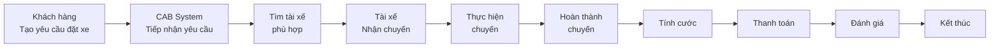
Đây chính là luồng nghiệp vụ cốt lõi mà tài liệu mô tả: khách hàng tạo yêu cầu → tìm và phân công tài xế → thực hiện chuyến → tính cước → thanh toán → thông báo → đánh giá sau chuyến.
---

# 9.3. Quy trình tìm và phân công tài xế
Đây là phần cần thể hiện rõ vì nó là nghiệp vụ quan trọng của CAB System.
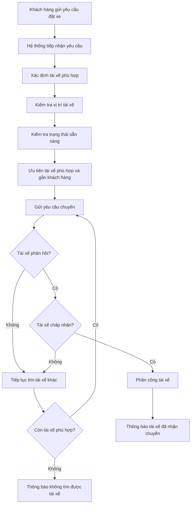
---

# 9.4. Quy trình thực hiện chuyến
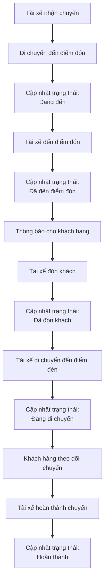
---

# 9.5. Quy trình tính cước và thanh toán
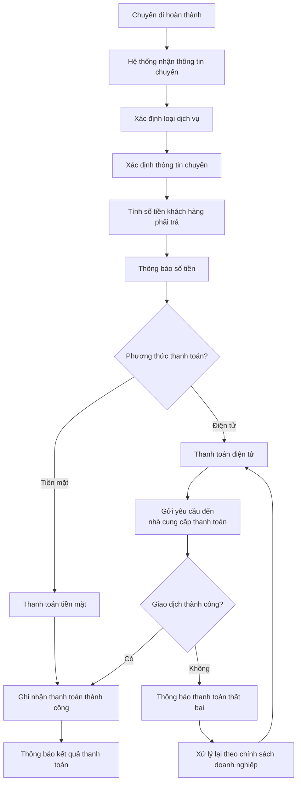
---

# 9.6. Quy trình thông báo
Thông báo không phải một bước duy nhất mà được thực hiện xuyên suốt quy trình.
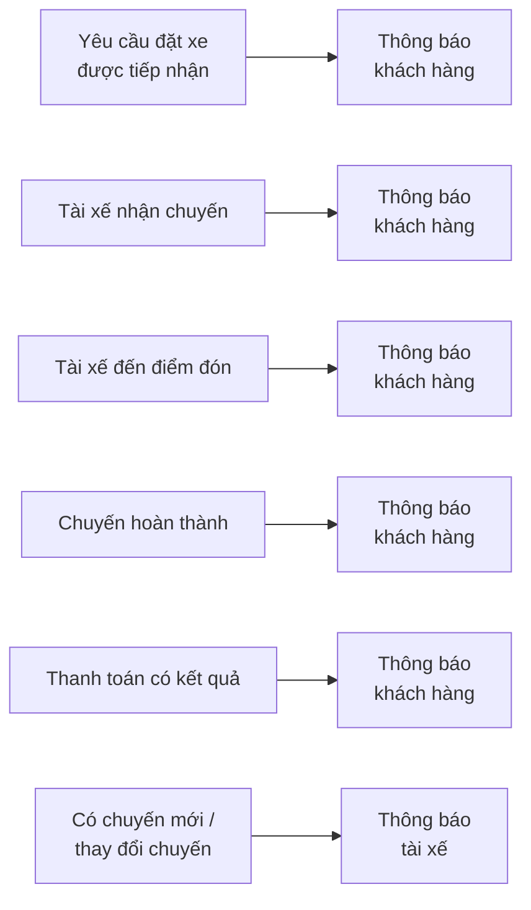
---

# 9.7. Quy trình vận hành và giám sát
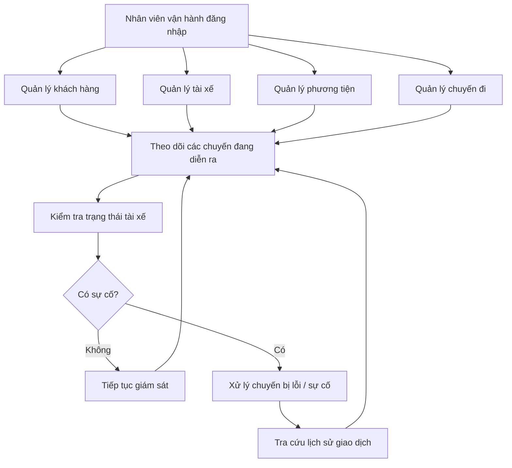
---

# 9.8. Quy trình báo cáo
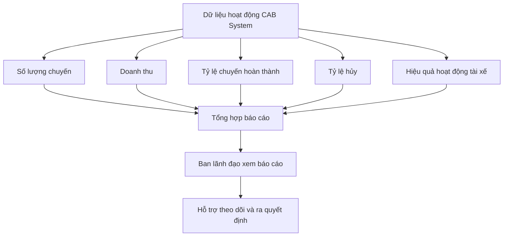
---

# BƯỚC 10 – PHÂN TÍCH CÁC QUY TẮC NGHIỆP VỤ

## 10.1. Danh sách quy tắc nghiệp vụ chính
| ID | Quy tắc nghiệp vụ | Nội dung |
|---|---|---|
| **BR01** | Xác thực người dùng | Khách hàng và tài xế phải đăng ký/đăng nhập và được xác thực trước khi sử dụng các chức năng yêu cầu tài khoản. |
| **BR02** | Phân quyền | Các chức năng quản trị phải được kiểm soát theo quyền; nhân viên thông thường không được thực hiện các thao tác nhạy cảm. |
| **BR03** | Tạo yêu cầu đặt xe | Khách hàng phải cung cấp thông tin cần thiết như điểm đón, điểm đến và loại xe trước khi gửi yêu cầu. |
| **BR04** | Tìm tài xế | Hệ thống phải tìm tài xế dựa trên vị trí, trạng thái sẵn sàng và các tiêu chí vận hành phù hợp. |
| **BR05** | Ưu tiên tài xế | Hệ thống mong muốn ưu tiên tài xế phù hợp và gần khách hàng. |
| **BR06** | Tài xế không phản hồi | Nếu tài xế được đề xuất không phản hồi, hệ thống phải tiếp tục tìm tài xế khác. |
| **BR07** | Tài xế từ chối chuyến | Nếu tài xế từ chối, hệ thống phải tiếp tục tìm tài xế khác mà không yêu cầu khách hàng tạo lại yêu cầu. |
| **BR08** | Không tìm được tài xế | Nếu không tìm được tài xế phù hợp, hệ thống phải thông báo rõ ràng cho khách hàng. |
| **BR09** | Cập nhật trạng thái chuyến | Tài xế phải cập nhật trạng thái chuyến trong quá trình thực hiện. |
| **BR10** | Lưu vị trí tài xế | Hệ thống lưu thông tin vị trí tài xế để hỗ trợ tìm tài xế gần khách hàng và dự kiến thời gian đến. |
| **BR11** | Tính cước | Sau khi chuyến hoàn thành, hệ thống phải xác định số tiền khách hàng phải trả dựa trên loại dịch vụ và thông tin chuyến đi. |
| **BR12** | Phương thức thanh toán | Khách hàng được thanh toán bằng tiền mặt hoặc phương thức thanh toán điện tử. |
| **BR13** | Thanh toán điện tử | Thanh toán điện tử phải được xử lý thông qua nhà cung cấp thanh toán bên ngoài. |
| **BR14** | Bảo vệ dữ liệu thanh toán | Hệ thống CAB không được lưu trực tiếp thông tin nhạy cảm của thẻ hoặc tài khoản thanh toán. |
| **BR15** | Thanh toán thất bại | Khi thanh toán điện tử thất bại, hệ thống phải thông báo cho khách hàng và cho phép xử lý lại theo chính sách doanh nghiệp. |
| **BR16** | Thông báo khách hàng | Khách hàng phải nhận được thông báo ở các sự kiện quan trọng của chuyến đi và thanh toán. |
| **BR17** | Thông báo tài xế | Tài xế phải nhận được thông báo về chuyến mới hoặc các thay đổi liên quan đến chuyến đang thực hiện. |
| **BR18** | Quản lý vận hành | Nhân viên vận hành được quản lý khách hàng, tài xế, phương tiện và chuyến đi theo quyền được cấp. |
| **BR19** | Giám sát hoạt động | Nhân viên vận hành có thể xem chuyến đang diễn ra, kiểm tra trạng thái tài xế và hỗ trợ xử lý chuyến bị lỗi. |
| **BR20** | Tra cứu giao dịch | Nhân viên vận hành có thể tra cứu lịch sử giao dịch theo quyền được cấp. |
| **BR21** | Báo cáo | Hệ thống phải cung cấp dữ liệu phục vụ báo cáo số lượng chuyến, doanh thu, tỷ lệ hoàn thành, tỷ lệ hủy và hiệu quả tài xế. |
---

## 10.2. Phân tích các quy tắc quan trọng
BR01 – Xác thực người dùng
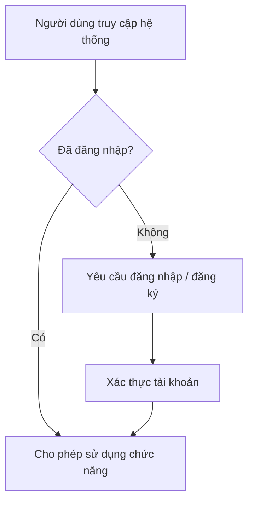
Quy tắc: Khách hàng và tài xế phải được xác thực trước khi sử dụng các chức năng yêu cầu tài khoản.
---

BR02 – Phân quyền quản trị
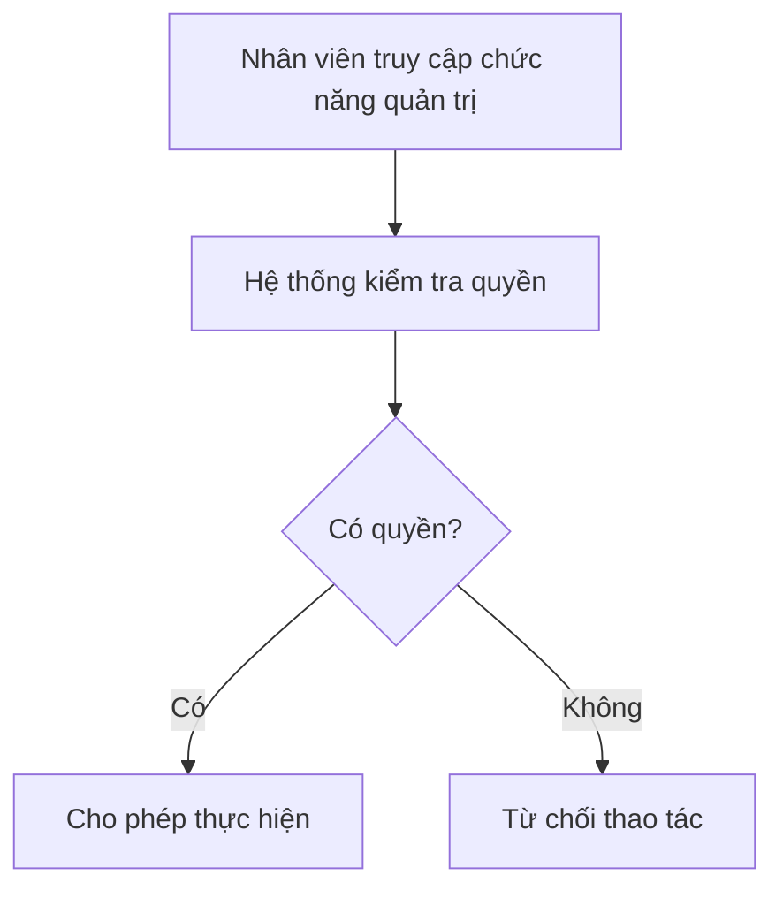
Quy tắc: Các thao tác quản trị phải được kiểm soát quyền truy cập; nhân viên thông thường không được thực hiện các thao tác nhạy cảm.
---

## 10.3. Quy tắc tìm và phân công tài xế
Đây là nhóm Business Rules quan trọng nhất của CAB System.
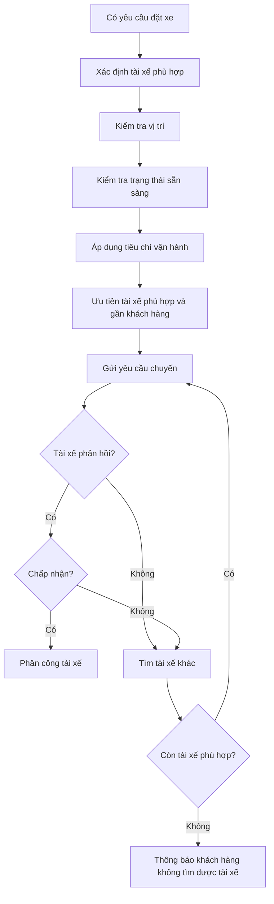
Các quy tắc
- BR04: Chỉ xem xét các tài xế phù hợp dựa trên vị trí, trạng thái sẵn sàng và tiêu chí vận hành.
- BR05: Hệ thống mong muốn ưu tiên tài xế phù hợp và gần khách hàng.
- BR06: Nếu tài xế không phản hồi, phải tiếp tục tìm tài xế khác.
- BR07: Nếu tài xế từ chối, phải tiếp tục tìm tài xế khác.
- BR08: Không yêu cầu khách hàng tạo lại yêu cầu khi hệ thống tiếp tục tìm tài xế.
- BR09: Nếu không còn tài xế phù hợp, phải thông báo rõ ràng cho khách hàng.
---

## 10.4. Quy tắc trạng thái chuyến đi
Tài xế phải cập nhật trạng thái trong quá trình thực hiện chuyến:
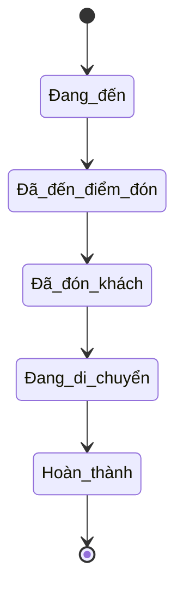
Quy tắc
- Tài xế phải cập nhật trạng thái theo quá trình thực hiện chuyến.
- Các trạng thái chính gồm:
    + Đã đến điểm đón
    + Đã đón khách
    + Đang di chuyển
    + Hoàn thành chuyến
- Hệ thống sử dụng trạng thái để khách hàng theo dõi chuyến.
---

## 10.5. Quy tắc tính cước và thanh toán
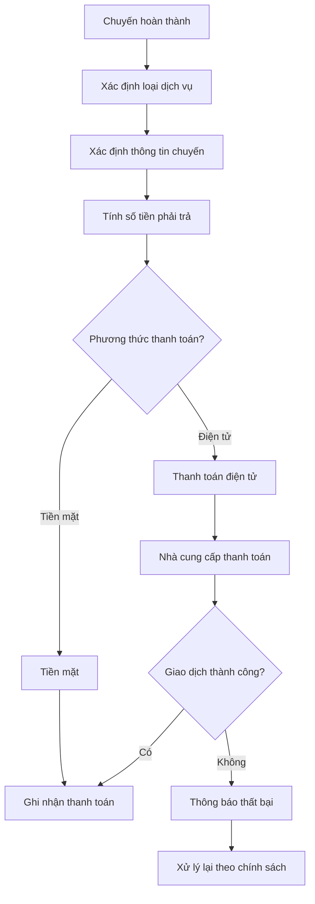
Quy tắc
- Chỉ xác định cước sau khi chuyến hoàn thành.
- Số tiền phải trả dựa trên loại dịch vụ và thông tin chuyến đi.
- Hỗ trợ tiền mặt.
- Hỗ trợ thanh toán điện tử.
- Thanh toán điện tử thông qua nhà cung cấp bên ngoài.
- Không lưu trực tiếp thông tin nhạy cảm của thẻ/tài khoản trong CAB.
- Khi giao dịch thất bại, phải thông báo và cho phép xử lý lại theo chính sách doanh nghiệp.
---

## 10.6. Quy tắc thông báo
---

## 10.7. Quy tắc quản lý vận hành
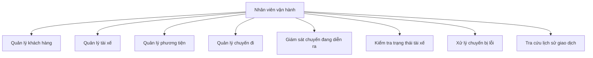
Quy tắc

Nhân viên vận hành được phép thực hiện các chức năng quản trị theo quyền được cấp, bao gồm quản lý khách hàng, tài xế, phương tiện, chuyến đi, giám sát chuyến đang diễn ra, kiểm tra trạng thái tài xế, xử lý chuyến bị lỗi và tra cứu lịch sử giao dịch.
---

## 10.8. Quy tắc báo cáo
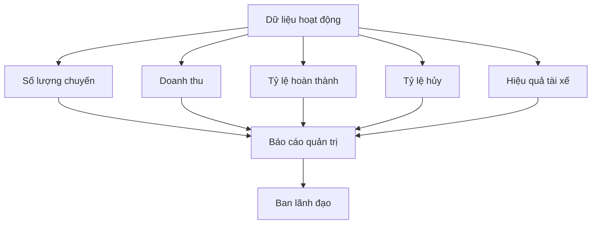
Hệ thống cần cung cấp dữ liệu phục vụ các báo cáo về số lượng chuyến, doanh thu, tỷ lệ chuyến hoàn thành, tỷ lệ hủy và hiệu quả hoạt động của tài xế
---

## 10.9. Quy tắc bảo mật và dữ liệu

