# CAB System – Thiết kế DDD (phân rã Bounded Context)

## 1. Phân loại Subdomain

| Loại | Subdomain | Lý do |
| --- | --- | --- |
| **Core** | Đặt xe, Phân công tài xế, Chuyến đi | Tạo khác biệt cạnh tranh, nghiệp vụ phức tạp nhất |
| **Supporting** | Tài xế & Phương tiện, Vị trí tài xế, Khách hàng, Tính cước, Thanh toán, Đánh giá, Vận hành, Báo cáo | Cần thiết nhưng không phải lợi thế cạnh tranh |
| **Generic** | Định danh & Truy cập, Thông báo | Có thể dùng giải pháp có sẵn / nhà cung cấp ngoài |

> Tính cước có thể nâng lên Core nếu ABC cạnh tranh bằng giá. Công thức cước chưa chốt nên tạm để Supporting.

---

## 2. Context Map

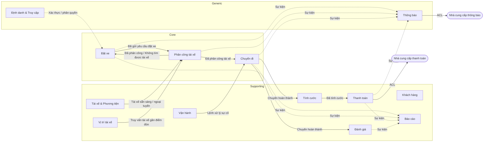

Quy ước: đường liền là quan hệ upstream → downstream, đường đứt là sự kiện / dịch vụ dùng chung. **ACL** (Anti-Corruption Layer) bọc nhà cung cấp bên ngoài.

---

## 3. Chi tiết từng Bounded Context

### 3.1. Định danh & Truy cập (Generic) – UC01, UC24, BR01–02, BR-S

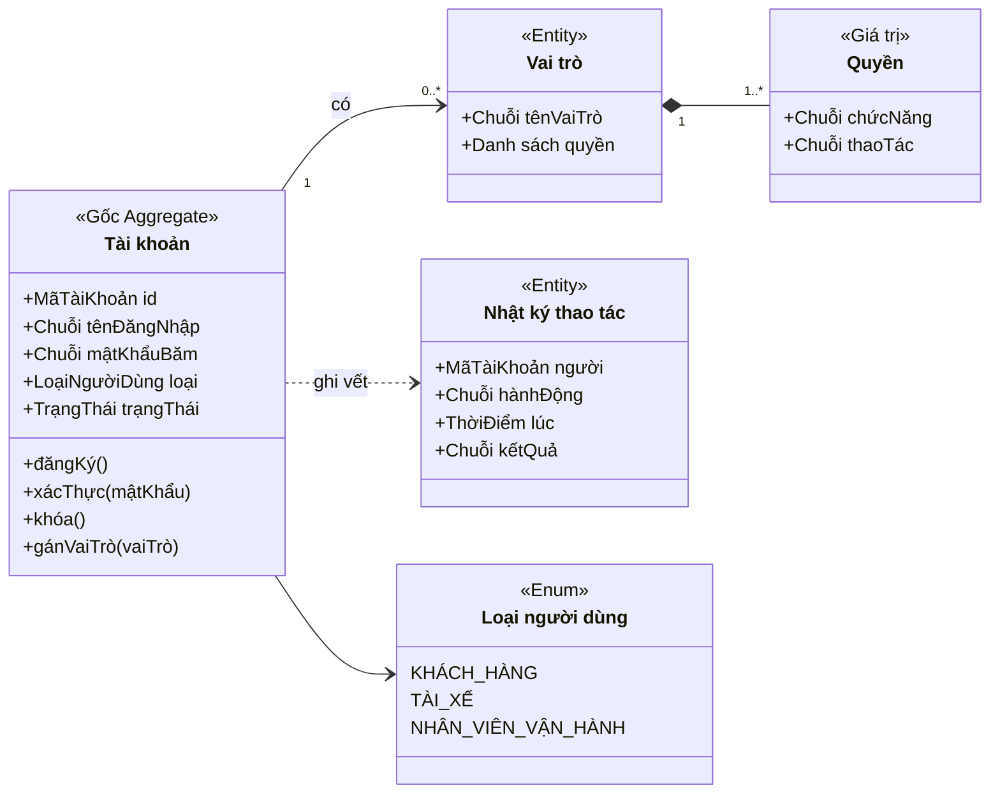

- Mật khẩu chỉ lưu dạng băm. Không xác định được quyền thì **từ chối và ghi nhật ký** (UC24).
- Thao tác quan trọng bắt buộc ghi `NhatKyThaoTac` (BR-S08).

### 3.2. Khách hàng (Supporting) – UC02, UC15, BR01

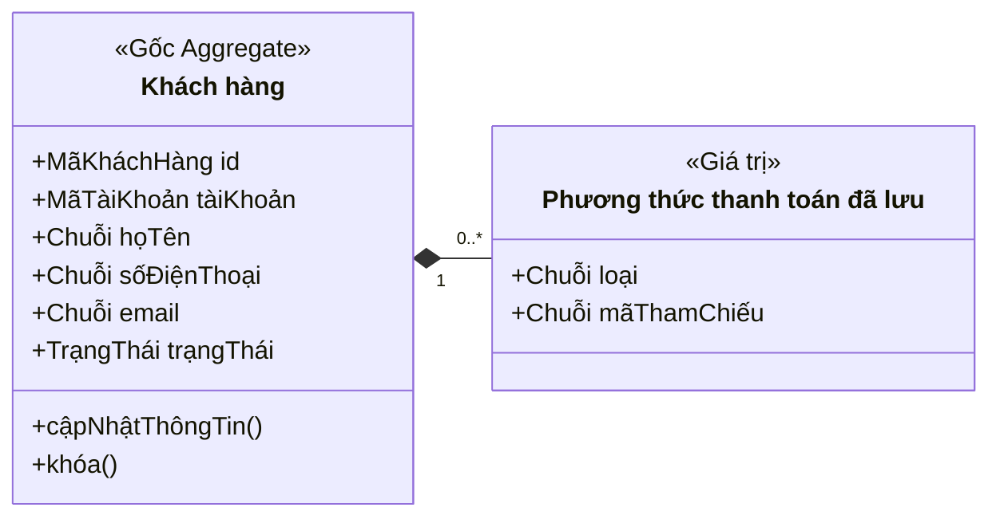

- `PhuongThucDaLuu` chỉ chứa **mã tham chiếu (token)** từ nhà cung cấp, không lưu dữ liệu thẻ (BR14, BR-S07).

### 3.3. Tài xế & Phương tiện (Supporting) – UC09–11, UC16–17

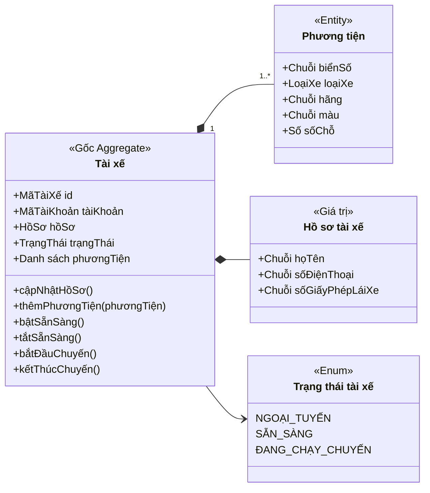

- Chỉ bật `SẴN_SÀNG` khi hồ sơ hợp lệ và có ít nhất một phương tiện hợp lệ.
- `ĐANG_CHẠY_CHUYẾN` được đặt khi nhận `ĐãPhânCôngTàiXế`, trả về `SẴN_SÀNG` khi nhận `ChuyếnHoànThành`. Nhân viên vận hành chỉnh sửa qua lệnh của context này (UC16–17).

### 3.4. Vị trí tài xế (Supporting) – UC14, BR10

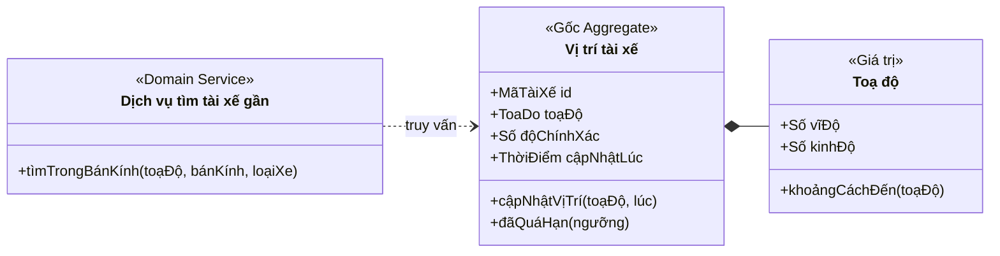

- Tách riêng vì **ghi tần suất cao** và cần chỉ mục địa lý. Phân công tài xế chỉ truy vấn, không sở hữu dữ liệu vị trí.
- Bỏ qua bản cập nhật cũ hơn vị trí đang lưu. Vị trí quá hạn không được đưa vào danh sách ứng viên.

### 3.5. Đặt xe (Core) – UC03, BR03

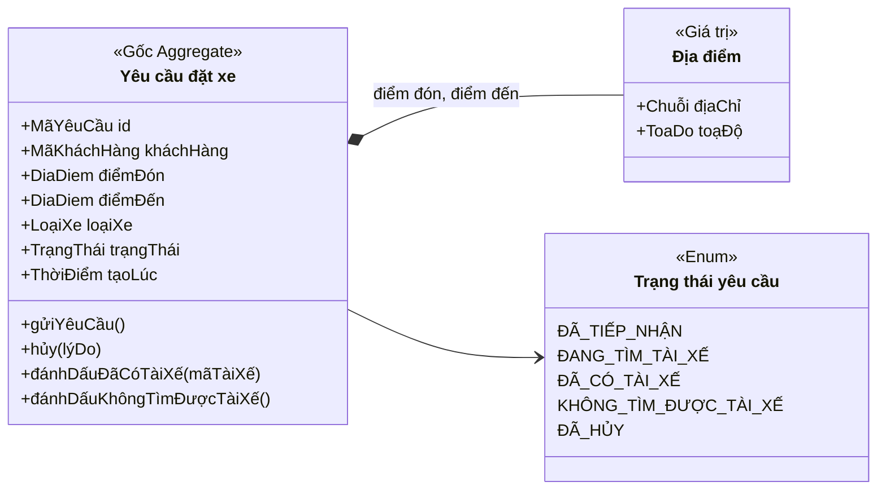

- Phải đủ **điểm đón, điểm đến, loại xe** trước khi gửi (BR03).
- Khi tài xế từ chối hoặc không phản hồi, yêu cầu **giữ nguyên**, khách không phải tạo lại (BR07). Việc tìm tiếp do context Phân công đảm nhiệm.
- Cho phép tối đa một yêu cầu đang hoạt động cho mỗi khách (đề xuất, cần BA xác nhận).

### 3.6. Phân công tài xế (Core) – UC04, UC12, BR04–09

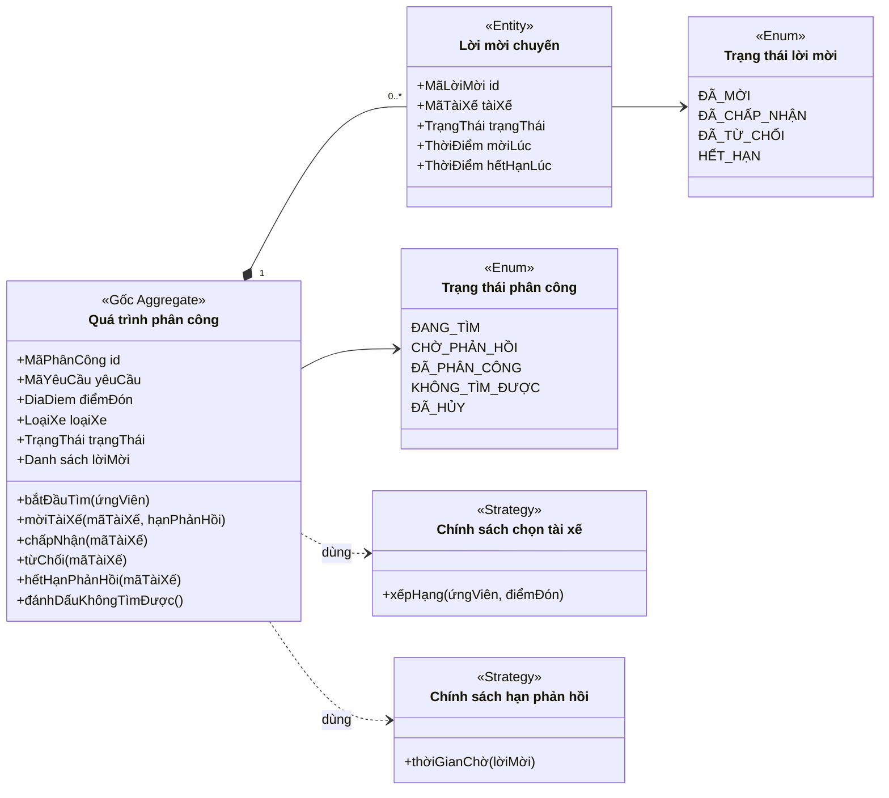

- Mỗi thời điểm chỉ có **một** lời mời ở trạng thái `ĐÃ_MỜI`.
- Không mời lại tài xế đã `ĐÃ_TỪ_CHỐI` hoặc `HẾT_HẠN` trong cùng quá trình (BR06–07).
- `chấpNhận()` chỉ hợp lệ khi lời mời chưa hết hạn, thành công thì phát `ĐãPhânCôngTàiXế`.
- Hết ứng viên thì phát `KhôngTìmĐượcTàiXế` (BR08–09).

### 3.7. Chuyến đi (Core) – UC05, UC07, UC13, UC18

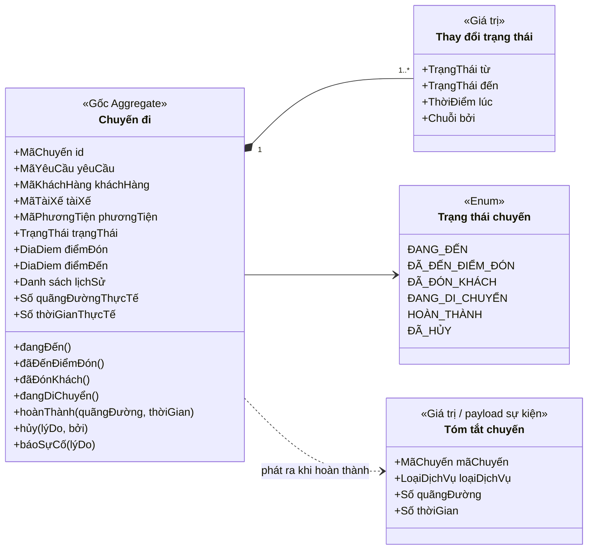

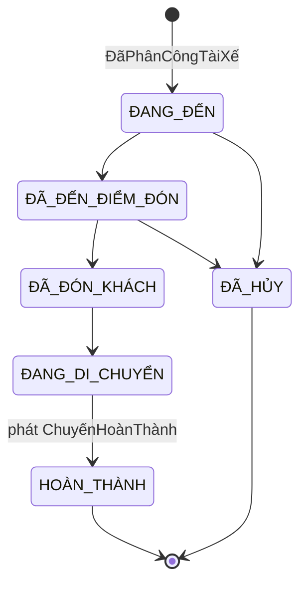

- Chuyến chỉ được tạo **sau khi có tài xế**. Trạng thái `ĐÃ_HỦY` là bổ sung, chờ chốt chính sách hủy.
- Chuyển sai thứ tự trạng thái thì ném lỗi nghiệp vụ.
- Tính cước nhận `TomTatChuyen` qua sự kiện, không truy cập trực tiếp aggregate `Chuyến đi`.

### 3.8. Tính cước (Supporting) – UC22, BR11

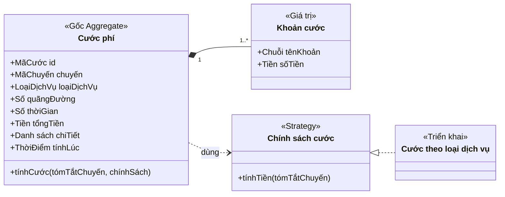

- Chỉ tính cước **sau khi chuyến hoàn thành**. Mỗi chuyến đúng một bản ghi cước.
- Thiếu thông tin thì không tính và báo lỗi (UC22).
- **Công thức chưa chốt** nên đặt sau `ChinhSachCuoc`, đổi công thức không sửa aggregate.

### 3.9. Thanh toán (Supporting) – UC06, UC20, BR12–15

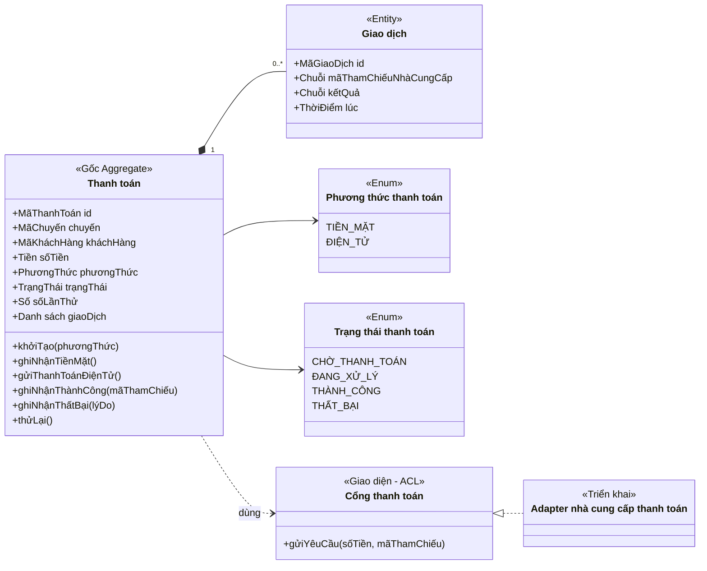

- **Không lưu** số thẻ hay tài khoản, chỉ lưu mã tham chiếu (BR14, BR-S07).
- Thất bại thì thông báo khách và cho phép `thửLại()` theo chính sách (BR15). `THÀNH_CÔNG` là trạng thái cuối, không đổi.
- Thêm phương thức thanh toán mới chỉ cần thêm adapter, domain không đổi.

### 3.10. Thông báo (Generic) – UC23, BR16–17

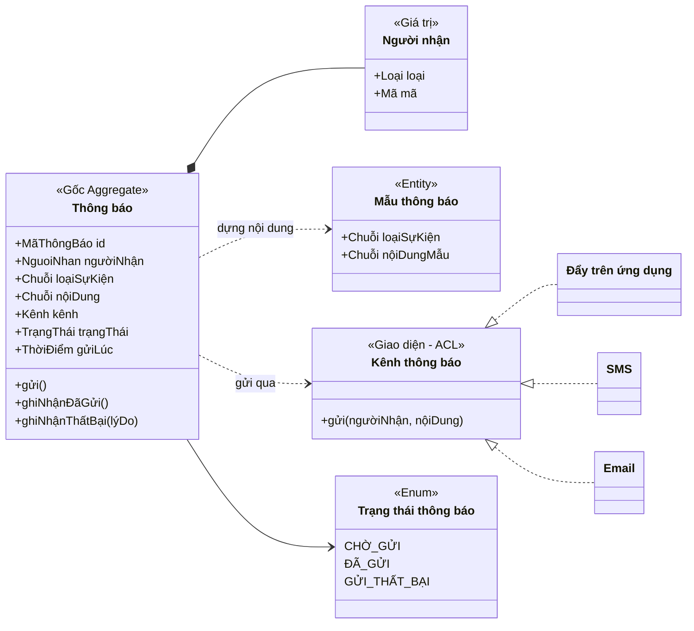

| Sự kiện | Người nhận |
| --- | --- |
| Yêu cầu đặt xe được tiếp nhận / Tài xế nhận chuyến / Tài xế đến / Chuyến hoàn thành / Thanh toán có kết quả | Khách hàng |
| Có chuyến mới / Có thay đổi liên quan đến chuyến | Tài xế |

- Gửi thất bại thì chỉ **ghi nhận trạng thái**, không làm hỏng luồng nghiệp vụ chính.
- Thêm kênh hoặc nhà cung cấp mới chỉ cần thêm một `KenhThongBao`.

### 3.11. Đánh giá (Supporting) – UC08

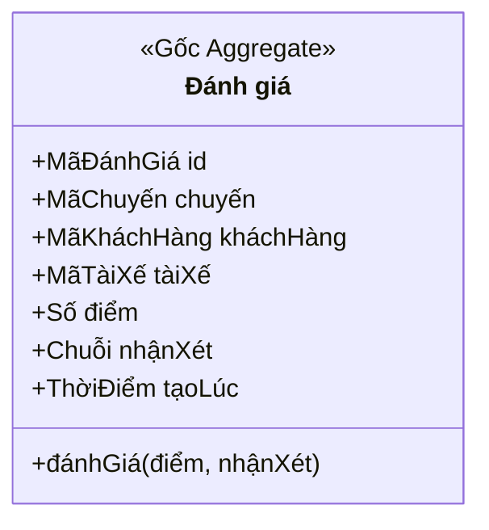

- Chỉ đánh giá được chuyến `HOÀN_THÀNH`, mỗi chuyến tối đa một đánh giá. Không đánh giá thì giữ trạng thái chưa đánh giá.
- Thang điểm 1–5 là đề xuất, cần BA xác nhận.

### 3.12. Vận hành (Supporting) – UC15–20, BR18–20

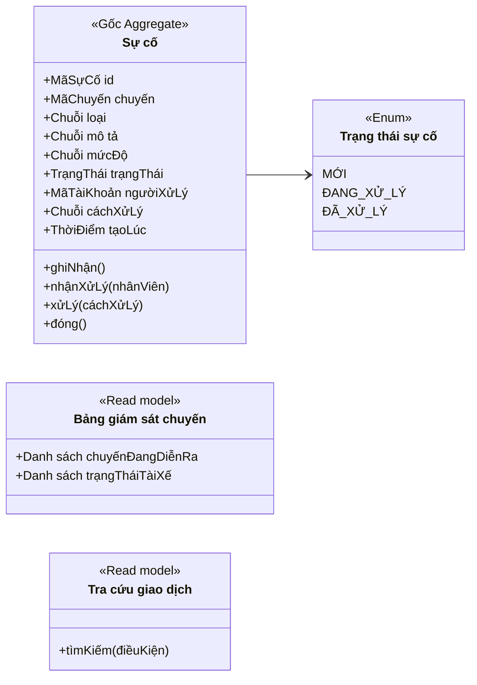

- Context này **không sở hữu** dữ liệu khách hàng, tài xế, phương tiện, chuyến. Nhân viên thao tác qua lệnh của context tương ứng, kèm kiểm tra quyền.
- Chỉ `Sự cố` là aggregate. Giám sát và tra cứu giao dịch là read model cập nhật từ sự kiện.
- Không đủ quyền thì từ chối (UC19).

### 3.13. Báo cáo (Supporting) – UC21, BR21

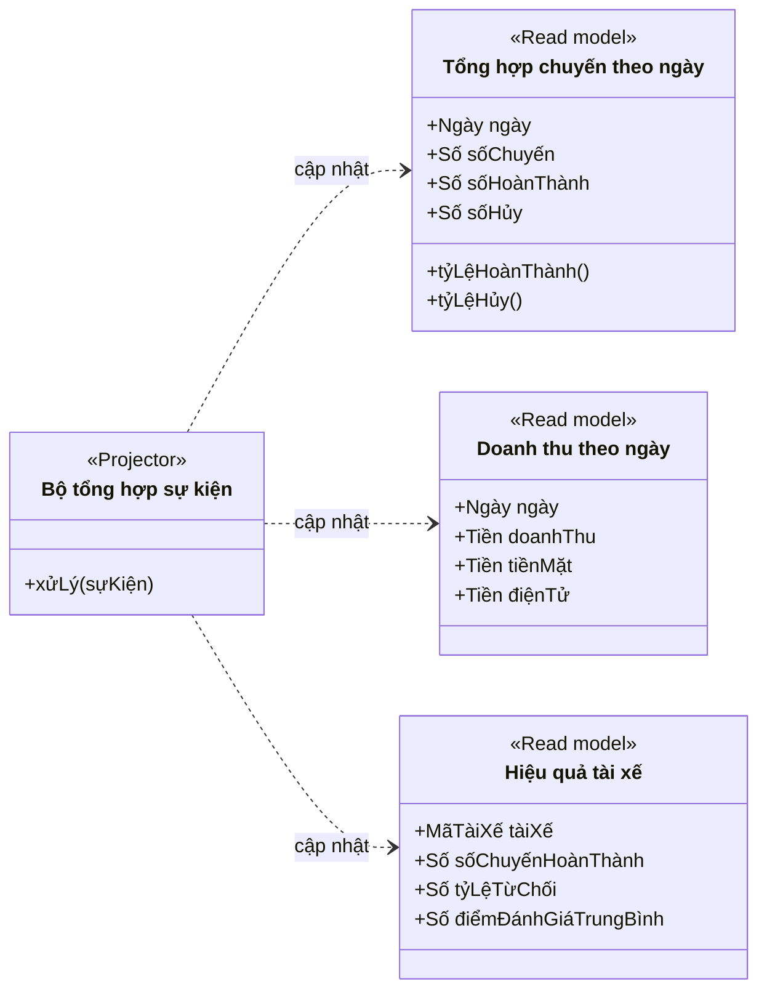

- Chỉ đọc sự kiện (CQRS), **không ghi ngược** vào context khác.

---

## 4. Bảng sự kiện miền

| Sự kiện | Phát bởi | Nhận bởi |
| --- | --- | --- |
| ĐãGửiYêuCầuĐặtXe | Đặt xe | Phân công, Thông báo, Báo cáo |
| TàiXếĐượcĐềNghị | Phân công | Thông báo (tài xế) |
| ĐãPhânCôngTàiXế | Phân công | Chuyến đi, Đặt xe, Tài xế & Phương tiện, Thông báo |
| KhôngTìmĐượcTàiXế | Phân công | Đặt xe, Thông báo |
| TàiXếĐãĐếnĐiểmĐón | Chuyến đi | Thông báo |
| ChuyếnHoànThành | Chuyến đi | Tính cước, Đánh giá, Tài xế & Phương tiện, Thông báo, Báo cáo |
| ChuyếnBịHủy | Chuyến đi | Thông báo, Báo cáo |
| ĐãTínhCước | Tính cước | Thanh toán, Thông báo |
| ThanhToánThànhCông / ThanhToánThấtBại | Thanh toán | Thông báo, Báo cáo |
| ĐãĐánhGiáTàiXế | Đánh giá | Báo cáo |
| SựCốPhátSinh / SựCốĐãXửLý | Vận hành | Báo cáo |

Cập nhật vị trí tài xế **không phát sự kiện ra ngoài**, Phân công truy vấn trực tiếp.

---

## 5. Thuật ngữ chung (Ubiquitous Language)

| Thuật ngữ | Ý nghĩa | Không nhầm với |
| --- | --- | --- |
| Yêu cầu đặt xe | Nhu cầu của khách, chưa có tài xế | Chuyến đi |
| Chuyến đi | Phát sinh sau khi có tài xế, gồm các trạng thái ĐANG_ĐẾN → HOÀN_THÀNH | Yêu cầu đặt xe |
| Lời mời chuyến | Đề nghị gửi cho một tài xế, có hạn phản hồi | Chuyến đi |
| Phân công | Kết quả khi một tài xế chấp nhận lời mời | Tìm tài xế (quá trình) |
| Cước phí | Số tiền tính ra sau chuyến | Thanh toán |
| Thanh toán | Việc ghi nhận khách đã trả (tiền mặt / điện tử) | Cước phí |

## 6. Quyết định thiết kế

1. **Aggregate tham chiếu nhau bằng ID** (`mãKháchHàng`, `mãTàiXế`, `mãChuyến`), không giữ đối tượng của context khác.
2. **Các mục "chưa chốt" (4.3 README) thành Policy/Strategy:** `ChinhSachChonTaiXe`, `ChinhSachHanPhanHoi`, `ChinhSachCuoc`, chính sách hủy.
3. **Luồng sau chuyến là saga theo sự kiện (choreography):** ChuyếnHoànThành → ĐãTínhCước → Thanh toán → Thông báo → Đánh giá.
4. **Triển khai 7 tuần:** Modular Monolith, mỗi Bounded Context là một module, giao tiếp qua event bus nội bộ (kèm Outbox). Khi cần mở rộng thì tách Vị trí tài xế và Thông báo ra service riêng trước.

---

## 7. Phân tích High cohesion & Loose coupling

### 7.1. High cohesion (nội bộ mỗi miền)

Tiêu chí: cùng một lý do thay đổi, cùng thuật ngữ, cùng ranh giới nhất quán dữ liệu (aggregate).

| Miền | Lý do thay đổi duy nhất | Cohesion | Nhận xét |
| --- | --- | --- | --- |
| Đặt xe | Quy tắc tạo/hủy yêu cầu | Cao | Chỉ giữ dữ liệu yêu cầu, không lẫn logic tìm tài xế |
| Phân công | Thuật toán chọn tài xế, xử lý lời mời | Cao | Toàn bộ BR04–09 nằm gọn một aggregate |
| Chuyến đi | Vòng đời và trạng thái chuyến | Cao | State machine thuộc về một aggregate |
| Tính cước | Công thức cước | Cao | Đổi công thức chỉ sửa `ChinhSachCuoc` |
| Thanh toán | Xử lý và retry thanh toán | Cao | Tiền mặt và điện tử cùng một vòng đời thanh toán |
| Thông báo | Kênh, mẫu, trạng thái gửi | Cao | Không chứa nghiệp vụ của miền khác |
| Vị trí tài xế | Cập nhật và truy vấn vị trí | Cao | Tách riêng vì đặc thù ghi nhiều |
| Khách hàng, Đánh giá, Báo cáo | Hồ sơ / đánh giá / tổng hợp | Cao | Nhỏ, một trách nhiệm |
| Định danh & Truy cập | Chính sách xác thực, phân quyền | Cao | `NhatKyThaoTac` mang tính xuyên suốt, có thể tách khi lớn |
| **Tài xế & Phương tiện** | Hồ sơ, phương tiện, trạng thái | **Trung bình** | Ba mối quan tâm. `ĐANG_CHẠY_CHUYẾN` do sự kiện chuyến điều khiển, không phải do hồ sơ |
| **Vận hành** | Xử lý sự cố | **Trung bình** | Chỉ `Sự cố` là aggregate thật. Phần còn lại là lớp điều phối và read model |

Theo dõi: nếu Tài xế & Phương tiện phình ra, tách `Phương tiện` hoặc `Trạng thái hoạt động` thành context riêng.

### 7.2. Loose coupling (giữa các miền)

Tiêu chí: giao tiếp bất đồng bộ qua sự kiện, chỉ tham chiếu bằng ID, không chia sẻ CSDL, ít phụ thuộc về thời gian.

| Từ → Đến | Cơ chế | Mức độ | Ghi chú |
| --- | --- | --- | --- |
| Đặt xe → Phân công | Sự kiện `ĐãGửiYêuCầuĐặtXe` | Lỏng | Sự kiện phải mang đủ điểm đón, loại xe |
| Phân công → Đặt xe | Sự kiện kết quả | Lỏng nhưng **vòng** | Hai miền phụ thuộc lẫn nhau qua sự kiện |
| Tài xế & PT → Phân công | Sự kiện sẵn sàng / ngoại tuyến | Lỏng | Phân công giữ bản sao cục bộ |
| **Vị trí → Phân công** | **Truy vấn đồng bộ** | **Chặt nhất** | Phụ thuộc về thời gian: Vị trí chậm thì phân công chậm |
| Phân công → Chuyến đi | Sự kiện `ĐãPhânCôngTàiXế` | Lỏng | |
| Chuyến đi → Tính cước | Sự kiện kèm `TomTatChuyen` | Lỏng | Tính cước không đọc aggregate `Chuyến đi` |
| Tính cước → Thanh toán | Sự kiện `ĐãTínhCước` | Lỏng | |
| Thanh toán → Nhà cung cấp | ACL (`CongThanhToan`) | Lỏng | Cần timeout và retry |
| Nhiều miền → Thông báo | Sự kiện | Lỏng, fan-in cao | Cần ngôn ngữ sự kiện chung ổn định |
| Nhiều miền → Báo cáo | Sự kiện, một chiều | Lỏng | |
| **Vận hành → Chuyến đi / KH / Tài xế** | Lệnh đồng bộ | **Trung bình** | Phải đi qua API công khai và kiểm quyền |
| Nhiều miền → Định danh | Xác thực / phân quyền | Trung bình | Dùng token, tránh gọi đồng bộ mỗi lần |

### 7.3. Điểm yếu và cách xử lý

1. **Vòng Đặt xe ↔ Phân công.** Giữ một chiều dữ liệu: Phân công chỉ nhận sự kiện có đủ dữ liệu (event-carried state), không gọi ngược sang Đặt xe. Trạng thái yêu cầu trong Đặt xe chỉ cập nhật từ sự kiện kết quả.
2. **Vị trí → Phân công là khớp chặt nhất.** Đặt qua interface truy vấn (`DichVuTimTaiXeGan`), thêm timeout và cache ngắn hạn. Nếu Vị trí lỗi thì phân công thoái hóa (dùng vị trí cuối đã biết), không dừng hẳn.
3. **Trạng thái sẵn sàng của tài xế bị chia hai chỗ.** Phân công giữ read model `TàiXếKhảDụng` cập nhật từ sự kiện, không gọi sang Tài xế & PT khi tìm.
4. **Vận hành chạm nhiều miền.** Chỉ gọi qua application service của từng miền, không truy cập trực tiếp CSDL của miền khác.
5. **Shared Kernel tối thiểu.** Chỉ chia sẻ Value Object nhỏ và ổn định: `ToaDo`, `Tien`, `LoaiXe`, các kiểu `Ma...`. Mọi thứ khác thuộc riêng từng miền.

### 7.4. Kết luận

- **Cohesion:** 11/13 miền cao, 2 miền trung bình (Tài xế & Phương tiện, Vận hành).
- **Coupling:** phần lớn lỏng nhờ sự kiện và ID. Cần lưu ý ba chỗ: truy vấn đồng bộ Vị trí → Phân công, vòng Đặt xe ↔ Phân công, và lệnh của Vận hành.

---

## 8. Rà soát bản vẽ Domain Model (class diagram tổng hợp) so với thiết kế DDD ở trên

Bản vẽ tổng hợp (ảnh) đang **không khớp** với thiết kế Bounded Context ở Mục 3 và với các quyết định ở Mục 7. Danh sách lỗi cụ thể:

### 8.1. Lỗi gộp sai Bounded Context

| Trong bản vẽ | Vấn đề | Theo thiết kế đúng (Mục 3) |
| --- | --- | --- |
| `DatXe_QuanLyChuyen` gộp **Đặt xe + Chuyến đi** thành một, aggregate `ChuyenDi` mang luôn `maKhachHang, maLoaiXe, maTaiXe, maPhuongTien, thoiGianDat, lyDoHuy` | Xoá mất khái niệm **Yêu cầu đặt xe** (chưa có tài xế). Vi phạm chính nguyên tắc đã nêu ở 3.5 và Mục 5 (Ubiquitous Language): *"Chuyến đi ≠ Yêu cầu đặt xe"*, và quy tắc *"Chuyến chỉ được tạo sau khi có tài xế"* (3.7) | Tách 2 aggregate: `YeuCauDatXe` (3.5) và `ChuyenDi` (3.7), liên kết qua `maYeuCau` |
| `TinhCuoc_ThanhToan` gộp **Tính cước + Thanh toán** thành một, `GiaoDichThanhToan` không có `soLanThu`, không tách `TrangThaiThanhToan` riêng | Hai domain có **lý do thay đổi khác nhau** (công thức cước vs. retry/cổng thanh toán bên thứ ba) → vi phạm high cohesion đã tự phân tích ở 7.1. Thiếu cơ chế `thửLại()` (BR15) | Tách `CuocPhi` (3.8) và `ThanhToan` (3.9, có `GiaoDich`, `CongThanhToan` ACL) |
| `QuanLyTaiXe_PhuongTien` gộp **Tài xế & Phương tiện + Vị trí tài xế**, quan hệ `TaiXe *-- 0..1 ViTriTaiXe` (composition) | Đúng thiết kế, `ViTriTaiXe` phải là **aggregate riêng**, ghi tần suất cao, chỉ tham chiếu bằng `maTaiXe` — không được là con của aggregate `TaiXe` (nếu không, mỗi lần cập nhật GPS sẽ phải khoá cả aggregate tài xế) | Tách `ViTriTaiXe` (3.4) làm BC riêng, tham chiếu ID, không composition |
| Thiếu hẳn Bounded Context **Báo cáo** | BR21/README yêu cầu báo cáo số chuyến, doanh thu, tỷ lệ hoàn thành/huỷ, hiệu quả tài xế | Cần thêm module `BaoCao` với các read model (3.13) |

### 8.2. Lỗi đặt tên / thuộc tính lệch với Mục 3

- `PhanCongTaiXe.YeuCauPhanCong` nên đổi tên đúng thuật ngữ là **`QuaTrinhPhanCong`** (3.6); entity `LuotDeXuat` nên là **`LoiMoi`** và cần có `trangThai` (Enum `ĐÃ_MỜI/ĐÃ_CHẤP_NHẬN/ĐÃ_TỪ_CHỐI/HẾT_HẠN`) + `hanPhanHoi`, hiện bản vẽ chỉ có `ketQua`, `thoiGianDeXuat`, `thoiGianPhanHoi` — không đủ để áp BR06–07 (không mời lại tài xế đã từ chối/hết hạn).
- `TaiKhoan` thiếu thuộc tính `matKhauBam`, `loaiNguoiDung` thể hiện rõ trong bản vẽ — chỉ thấy `matKhauMaHoa`, cần đổi thành **băm (hash)**, không phải "mã hoá" (mã hoá gợi ý có thể giải mã ngược — sai nguyên tắc bảo mật BR-S07 tương tự).

### 8.3. Sơ đồ tổng hợp đã sửa (khớp đúng Mục 3.1–3.13)

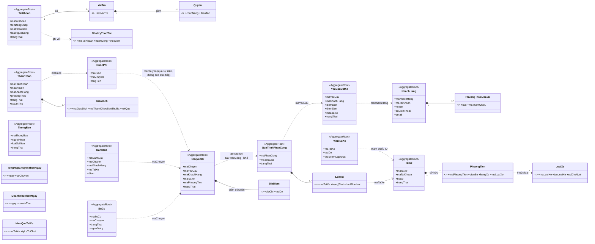

**Nguyên tắc bắt buộc giữ khi vẽ lại:** mỗi Bounded Context = 1 khung/subgraph riêng, các quan hệ **giữa** context chỉ được vẽ bằng đường đứt (`..>`) tham chiếu ID, tuyệt đối không composition (`*--`) xuyên context — vì composition ngụ ý cùng một aggregate/transaction boundary.
